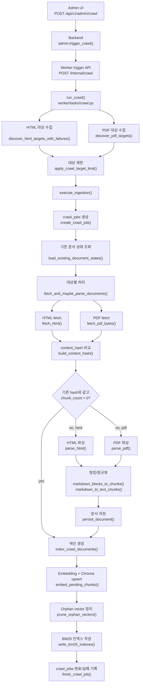
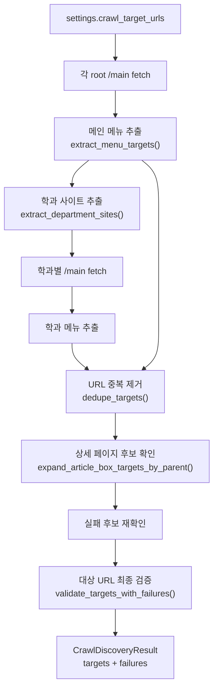
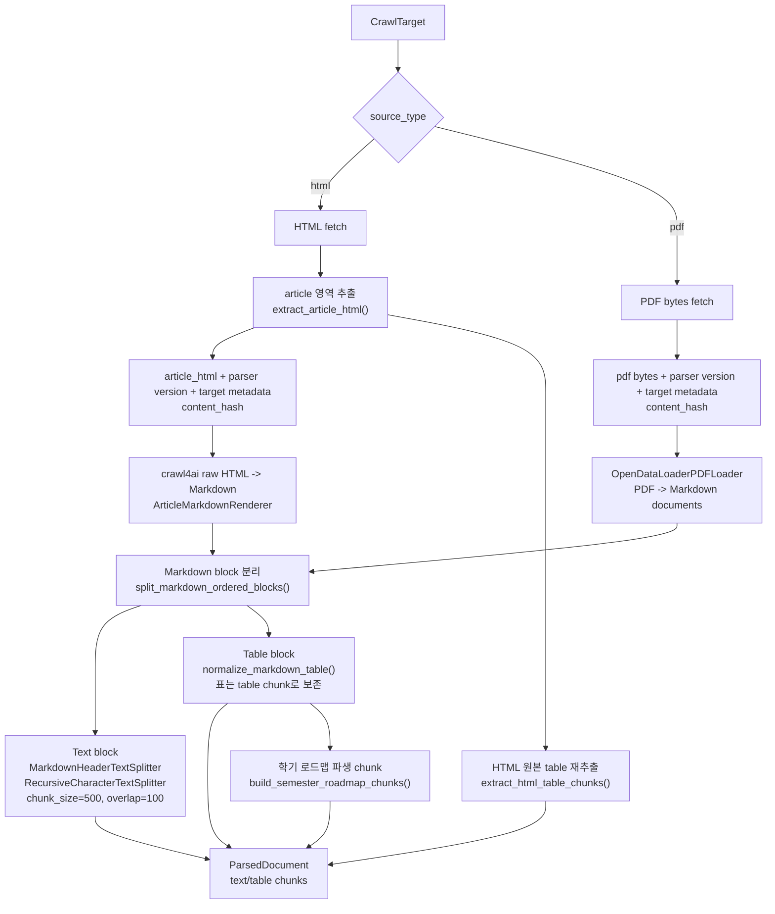
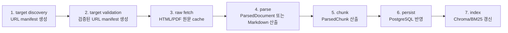

# 크롤링·파싱·청킹·색인 파이프라인

## 목적

worker 크롤링 작업은 주소 수집, 검증, 문서 fetch, 파싱, 청킹, 저장, 벡터/BM25 색인을 단일 `run_crawl()` 흐름에서 수행한다. 정리 범위는 현재 실행 단위와 중간 산출물 경계다.

## 현재 전체 흐름



## HTML 대상 수집 흐름



HTML discovery는 메뉴 수집, 학과 사이트 확장, `article.articleBox` 후보 확장, 실패 후보 재시도, 최종 본문 검증을 포함한다.

## 문서 처리와 청킹 흐름



## 단계별 현재 경계

| 단계 | 현재 대표 함수 | 현재 산출물 | 재시작/재사용 관점 |
| --- | --- | --- | --- |
| 트리거 | `CrawlTriggerService.trigger()` | worker 메모리 상태 | 실행 중복 방지만 수행. 단계별 resume 단위 없음 |
| HTML discovery | `discover_html_targets_with_failures()` | `CrawlDiscoveryResult` | DB/파일 저장 없음 |
| PDF discovery | `discover_pdf_targets()` | `list[CrawlTarget]` | DB/파일 저장 없음 |
| 대상 제한 | `apply_crawl_target_limit()` | 제한된 target 목록 | 실행 중 메모리 값 |
| crawl job 시작 | `create_crawl_job()` | `crawl_jobs` row | 진행률/결과 기록용. target manifest 저장 없음 |
| 기존 문서 비교 | `load_existing_document_states()` + `build_content_hash()` | skip/change 판단 | 원문 raw cache 없이 매번 URL fetch 후 비교 |
| HTML 파싱 | `parse_html()` | `ParsedDocument` | markdown/raw HTML 중간 산출물 저장 없음 |
| PDF 파싱 | `parse_pdf()` | `ParsedDocument` | PDF bytes/loader 결과 중간 산출물 저장 없음 |
| 청킹 | `markdown_blocks_to_chunks()` | `ParsedChunk` 목록 | parser/chunking 변경 시 기존 chunk 재생성 단위가 문서 저장과 결합됨 |
| 저장 | `persist_document()` | `documents`, `document_chunks` | 문서 단위로 기존 chunk 삭제 후 새 chunk 삽입 |
| 벡터 색인 | `index_crawl_documents()` | Chroma vector + `chroma_id` | `chroma_id IS NULL` chunk만 pending 처리 |
| BM25 작성 | `write_bm25_indexes()` | `.data/bm25` cache | 벡터 색인 단계 뒤에 같은 ingestion 흐름에서 실행 |
| 완료 기록 | `finish_crawl_job()` | `crawl_jobs.status` | 전체 흐름의 완료/실패만 기록 |

## 현재 구조에서 오래 걸리는 이유

현재 실행 단위는 다음과 같이 구성된다.

```text
run_crawl()
  = URL discovery
  + URL validation
  + document fetch
  + HTML/PDF parsing
  + chunking
  + PostgreSQL persistence
  + Chroma embedding
  + BM25 indexing
```

파싱 또는 청킹 로직 검증 시에도 표준 진입점은 주소 수집과 URL 검증부터 다시 시작한다. discovery 결과, 검증된 target manifest, raw HTML/PDF, Markdown 변환 결과, chunk 결과가 독립적인 재사용 산출물로 남지 않는다.

## 모듈화 시 나눌 만한 실행 단위

현재 흐름 기준의 후보 실행 단위는 다음과 같다. 미구현 구조다.



해당 경계가 분리되면 청킹 로직 변경 시 `raw fetch` 또는 `parse` 산출물을 재사용하고, `chunk -> persist -> index` 단계만 재실행할 수 있다.

## 관련 코드

- [worker/tasks/crawl.py](../../../worker/tasks/crawl.py)
- [worker/tasks/parse.py](../../../worker/tasks/parse.py)
- [worker/tasks/parsers/markdown.py](../../../worker/tasks/parsers/markdown.py)
- [worker/tasks/storage.py](../../../worker/tasks/storage.py)
- [worker/tasks/embed.py](../../../worker/tasks/embed.py)
- [worker/tasks/bm25.py](../../../worker/tasks/bm25.py)
- [worker/tasks/trigger.py](../../../worker/tasks/trigger.py)
- [backend/app/api/routes/admin.py](../../../backend/app/api/routes/admin.py)
