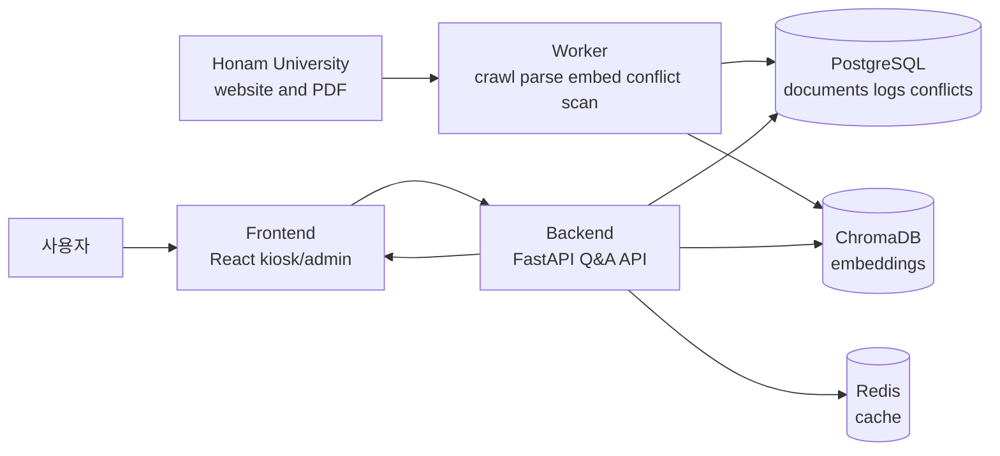
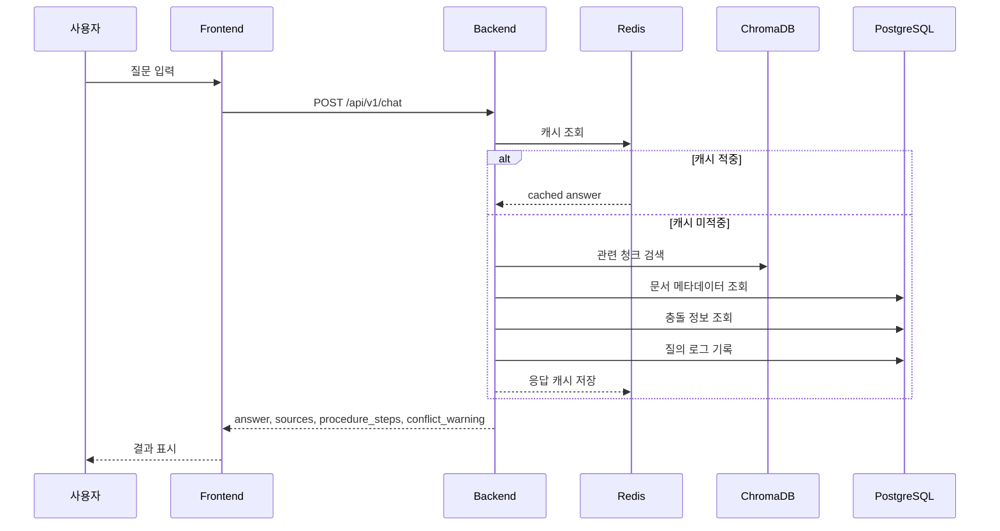

# campus-copilot 아키텍처 설계

**날짜**: 2026-04-08
**프로젝트**: 호남대학교 홈페이지 크롤링 기반 공식 문서 신뢰성 안내 키오스크

---

## 1. 개요

학교 홈페이지를 주기적으로 수집·갱신하고, 현장 키오스크에서 출처·최신성·충돌 여부를 함께 보여주며 질의응답과 절차 안내를 제공하는 시스템.

**대상 사용자**: 예비학생·학부모 / 행사 방문객 / 학생지원센터 앞에서 막힌 학생
**크롤링 대상**: https://www.honam.ac.kr

---

## 2. 서비스 구조 (2-tier)

배포 구조는 **애플리케이션 계층 + 데이터 계층의 2-tier** 로 유지한다.
애플리케이션 계층 내부 책임은 `frontend`, `backend`, `worker` 로 분리해 UI, 실시간 질의응답, 배치 수집/가공을 서로 섞지 않는다.

```
┌─────────────────────────────────────────────────┐
│  ☁️  AWS EC2 (또는 로컬 노트북 docker compose)     │
│                                                 │
│  ┌──────────────────┐   ┌──────────────────┐   │
│  │  api-server      │   │  crawler-worker  │   │
│  │  FastAPI         │   │  APScheduler     │   │
│  │  RAG pipeline    │   │  Crawl4AI        │   │
│  │  Google Gen AI/Ollama │ │ opendataloader │   │
│  └──────────────────┘   └──────────────────┘   │
│                                                 │
│  ┌──────────┐ ┌───────────┐ ┌───────┐          │
│  │PostgreSQL│ │ ChromaDB  │ │ Redis │          │
│  └──────────┘ └───────────┘ └───────┘          │
└─────────────────────────────────────────────────┘
             ↕ HTTPS / REST API
┌──────────────────────────────────────────┐
│  🍓 라즈베리파이 (키오스크)                │
│  Chromium — kiosk mode                  │
│  React 앱 렌더링만                        │
│  Docker 불필요                           │
│                                          │
│  print-service (localhost:6310)          │
│    └─ python-escpos → USB 열전사 프린터   │
└──────────────────────────────────────────┘
```

### 환경 전환

`.env` 파일 하나로 로컬 ↔ AWS 전환.

```bash
# 로컬 개발/데모
API_URL=http://192.168.x.x:8000
LLM_PROVIDER=ollama

# AWS 운영
API_URL=https://campus-copilot.com
LLM_PROVIDER=gemini
```

### 데이터 흐름도



이 흐름에서 `worker` 는 공식 문서를 수집하고 가공해 저장소에 적재하고, `backend` 는 적재된 데이터를 조회해 답변을 구성하며, `frontend` 는 결과를 표시하는 역할만 가진다.

---

## 3. 파싱 전략

기존 `hnu-ai` 프로젝트에서 Docling 사용 시 복잡한 표·PDF 품질 문제 발생 → 콘텐츠 유형별 최적 파서로 교체.

### HTML 페이지 — 자동 파서 선택 전략

페이지마다 어떤 파서를 쓸지 사람이 결정하는 것은 불가능. **"크롤 먼저, 그 안에서 자동 판별"** 방식 채택.

```
fetch(url)
    │
    ├─ URL ends with .pdf  ──→  PDFParser (opendataloader-pdf)
    │
    └─ HTML
         │
         ├─ Crawl4AI (항상 실행) ──→ fit_markdown → 텍스트 청크
         │
         └─ BeautifulSoup 표 감지
              article.articleBox 내 <table> 개수 확인
              │
              ├─ table 없음  → 텍스트 청크만 저장
              │
              └─ table 있음  → 커스텀 표 추출 추가 실행
                              → 텍스트 청크 + 표 청크 모두 저장
```

**핵심**: 한 페이지가 텍스트 청크와 표 청크를 **동시에** 생성할 수 있음.
사전 분류 불필요 — 모든 페이지가 동일한 파이프라인을 거침.

```python
async def parse_html_page(url: str, html: str) -> list[Chunk]:
    chunks = []
    # 1. 항상 텍스트 추출
    md = await crawl4ai_extract(html)
    chunks.extend(text_chunks(md))
    # 2. 표가 있으면 추가 추출
    soup = BeautifulSoup(html, "html.parser")
    for table in soup.select("article.articleBox table"):
        chunks.append(table_chunk(table))  # 청킹 없이 통째로
    return chunks
```

- DOM 구조: `article.articleBox` (본문), `ul#mainMenu` (메뉴 목록)
- curl_cffi `impersonate="chrome120"` 필수 (봇 탐지 우회)

### PDF 파일

**opendataloader-pdf hybrid mode** 사용.

- 표 정확도: 0.928 (Docling 0.887 대비 우위)
- 한국어 OCR: `--ocr-lang "ko,en"`
- LangChain 통합: `langchain-opendataloader-pdf`
- **주의**: `convert()` 호출마다 JVM 프로세스 생성 → 파일을 모아 배치 처리 필수
- 의존성: Java 11+ (worker Docker 이미지에 JDK 포함)

### 청킹 규칙

| 청크 유형 | 처리 방식 |
|----------|----------|
| 일반 텍스트 | MarkdownHeaderTextSplitter → RecursiveCharacterTextSplitter (size=500, overlap=100) |
| **표** | **청킹 금지**. 표 1개 = 청크 1개. `metadata["chunk_type"] = "table"` |

표 청크는 검색 시 통째로 LLM 컨텍스트에 삽입.

---

## 4. DB 스키마 (PostgreSQL)

Alembic으로 마이그레이션 관리. `meta`, `sources` 컬럼은 JSONB로 스키마 변경 없이 확장 가능.

### 테이블 목록

**documents**
```
id          UUID PK
url         TEXT UNIQUE      -- 변경 감지 기준
title       TEXT
menu_path   TEXT             -- "입학 > 전형안내"
category    TEXT             -- admission/scholarship/academic/...
source_type TEXT             -- 'html' | 'pdf'
content_hash TEXT            -- MD5, 변경된 페이지만 재인덱싱
crawled_at  TIMESTAMPTZ
is_active   BOOLEAN
```

**document_chunks**
```
id           UUID PK
document_id  UUID FK → documents.id
chunk_index  INT
content      TEXT
chunk_type   TEXT             -- 'text' | 'table'
chroma_id    TEXT             -- ChromaDB 벡터 ID
meta         JSONB            -- {headers, rows} 또는 {header_1, ...}
created_at   TIMESTAMPTZ
```

**conflict_pairs**
```
id            UUID PK
chunk_a_id    UUID FK → document_chunks.id
chunk_b_id    UUID FK → document_chunks.id
conflict_type TEXT    -- 'date' | 'procedure' | 'condition'
description   TEXT
severity      TEXT    -- 'warning' | 'critical'
detected_at   TIMESTAMPTZ
is_resolved   BOOLEAN
```

**query_logs**
```
id          UUID PK
query       TEXT
answer      TEXT
sources     JSONB    -- [{url, title, chunk_id}]
has_conflict BOOLEAN
response_ms INT
created_at  TIMESTAMPTZ
```

**crawl_jobs**
```
id               UUID PK
status           TEXT    -- 'running' | 'completed' | 'failed'
pages_crawled    INT
pages_changed    INT
conflicts_found  INT
started_at       TIMESTAMPTZ
completed_at     TIMESTAMPTZ
error            TEXT
```

---

## 5. API 엔드포인트 (FastAPI)

모든 라우트에 `/api/v1/` 버전 프리픽스. 키오스크 브라우저가 구버전을 유지해도 서비스 중단 없이 API 스키마 변경 가능.

### 사용자 (키오스크)

| 메서드 | 경로 | 설명 |
|--------|------|------|
| POST | `/api/v1/chat` | 질문 → 답변 + 출처 + 충돌경고 + 절차 |
| GET  | `/api/v1/categories` | 메인 화면 카테고리 버튼 목록 |
| GET  | `/api/v1/recent` | 최근 공지·행사 요약 |
| POST | `/api/v1/qr` | 답변 결과 → QR 코드 생성 |

### 운영자 화면

| 메서드 | 경로 | 설명 |
|--------|------|------|
| GET  | `/api/v1/admin/status` | 크롤링 상태, 문서 수, 마지막 갱신 |
| POST | `/api/v1/admin/crawl` | 수동 크롤링 트리거 |
| GET  | `/api/v1/admin/conflicts` | 충돌 감지 목록 |
| GET  | `/api/v1/admin/logs` | 질의 로그 |

### POST /api/v1/chat 응답 구조

```json
{
  "answer": "휴학 신청은 학생처 포털에서...",
  "sources": [
    { "title": "학사안내 > 휴학·복학", "url": "...", "crawled_at": "2025-03-15" }
  ],
  "procedure_steps": ["1. 포털 로그인", "2. 휴학신청서 작성", "3. 지도교수 승인"],
  "conflict_warning": {
    "exists": true,
    "description": "학사안내와 2024 공지의 신청 기한이 다릅니다."
  },
  "freshness": "recent"
}
```

### API 요청 흐름도



질의응답 경로는 항상 `frontend -> backend -> 저장소` 순서로 흐르고, 크롤링이나 파싱 같은 장기 작업은 API 요청 경로에 직접 들어오지 않는다.

---

## 6. 프로젝트 구조

```
campus-copilot/
├── docker-compose.yml          # 로컬 개발
├── docker-compose.prod.yml     # AWS 운영
├── .env.example
│
├── backend/
│   ├── Dockerfile
│   ├── pyproject.toml
│   ├── alembic/
│   │   └── versions/
│   └── app/
│       ├── main.py             # FastAPI 진입점
│       ├── api/
│       │   └── routes/
│       │       ├── chat.py
│       │       ├── categories.py
│       │       └── admin.py
│       ├── core/
│       │   ├── config.py       # pydantic-settings
│       │   └── db.py           # SQLAlchemy async engine
│       ├── models/             # SQLAlchemy ORM
│       ├── schemas/            # Pydantic 요청/응답
│       └── services/
│           ├── rag.py
│           ├── retriever.py    # Chroma + BM25 하이브리드
│           ├── llm.py          # LLM Provider 추상화
│           ├── freshness.py    # 최신성 점수 계산
│           └── conflict.py     # 충돌 쌍 조회
│
├── worker/
│   ├── Dockerfile              # Python + Java 11 JDK
│   ├── pyproject.toml
│   └── tasks/
│       ├── scheduler.py        # APScheduler (cron: 매일 새벽 3시)
│       ├── crawl.py            # Crawl4AI + curl-cffi
│       ├── parse.py            # opendataloader-pdf + BeautifulSoup4
│       ├── embed.py            # ko-sroberta + BM25 인덱싱
│       └── conflict_scan.py    # 크롤링 후 충돌 탐지
│
└── frontend/
    ├── Dockerfile              # nginx
    ├── package.json
    └── src/
        ├── pages/
        │   ├── KioskPage.tsx
        │   └── AdminPage.tsx
        └── components/
            ├── ChatBox.tsx
            ├── SourcePanel.tsx
            ├── ProcedureCard.tsx
            ├── ConflictBadge.tsx
            ├── QRModal.tsx
            ├── PrintButton.tsx     # ESC/POS 프린트 요청
            ├── TTSButton.tsx       # 음성 읽기 토글
            └── VoiceInput.tsx      # STT 마이크 버튼
│
└── pi-setup/                       # 라즈베리파이 전용 설정 (Docker 없음)
    ├── README.md                   # Pi 초기 설정 가이드
    ├── kiosk.sh                    # Chromium kiosk 모드 실행 스크립트
    └── print-service/
        ├── print_server.py         # python-escpos FastAPI 서버 (localhost:6310)
        ├── requirements.txt
        └── print-service.service   # systemd 유닛 파일
```

---

## 7. 확장성 설계

### ① LLM Provider Protocol

```python
class LLMProvider(Protocol):
    async def generate(self, prompt: str, context: list[str]) -> str: ...

class GeminiProvider(LLMProvider): ...
class OllamaProvider(LLMProvider): ...
# 추후: ClaudeProvider, OpenAIProvider
```

`rag.py`는 `LLMProvider` 인터페이스만 의존 → `.env`의 `LLM_PROVIDER` 값으로 런타임 교체.

### ② Parser Registry

```python
class DocumentParser(Protocol):
    def can_handle(self, url: str, content_type: str) -> bool: ...
    async def parse(self, content: str | bytes) -> ParsedDocument: ...

PARSERS = [HTMLParser(), PDFParser()]
# 추후: HWPParser, DOCXParser를 리스트에 추가만 하면 됨
```

### ③ 크롤 타겟 환경변수화

```bash
CRAWL_TARGET_URL=https://www.honam.ac.kr
CRAWL_CONTENT_SELECTOR=article.articleBox
CRAWL_MENU_SELECTOR=ul#mainMenu
CRAWL_SCHEDULE=0 3 * * *
```

다른 대학 배포 시 코드 수정 없이 `.env`만 교체.

### ④ Conflict Rule Registry

```python
class ConflictRule(Protocol):
    def detect(self, chunk_a: Chunk, chunk_b: Chunk) -> ConflictResult | None: ...

RULES = [DateConflictRule(), ProcedureConflictRule()]
# MVP: DateConflictRule만 구현 후 순차 추가
```

### ⑤ API 버전닝

모든 엔드포인트에 `/api/v1/` 프리픽스. 응답 스키마 변경 시 v2 추가, v1 유지.

---

## 8. 기술 스택 요약

오픈소스 패키지를 우선 사용. "직접 구현"은 도메인 특화 로직(표 파싱 전략, 충돌 탐지 규칙 등)에만 한정.

| 영역 | 오픈소스 패키지 |
|------|------|
| **Backend** | FastAPI, SQLAlchemy (async), Alembic, pydantic-settings, httpx, aiocache[redis] |
| **Worker** | Crawl4AI, curl-cffi, BeautifulSoup4, opendataloader-pdf[hybrid], APScheduler |
| **RAG** | ChromaDB, rank_bm25, sentence-transformers (jhgan/ko-sroberta-multitask), google-genai, ollama |
| **Frontend UI** | React, TypeScript, Tailwind CSS, lucide-react (아이콘), sonner (토스트 알림) |
| **Frontend 기능** | react-simple-keyboard (가상 키보드·한글), react-qr-code (QR 생성), zustand (상태 관리) |
| **Frontend 통신** | @tanstack/react-query, @microsoft/fetch-event-source (SSE POST 지원) |
| **프린터 (Pi)** | python-escpos, FastAPI (print-service) |
| **저장소** | PostgreSQL, ChromaDB, Redis |
| **인프라** | Docker Compose, AWS EC2, nginx, Raspberry Pi (Chromium kiosk) |
| **품질** | pytest, pytest-asyncio, ruff, pre-commit |

---

## 9. 성능 목표 및 UX 원칙

### 응답 지연 목표

키오스크 사용자는 서 있는 상태로 기다림. 3초 이상이면 이탈.

| 시나리오 | 목표 |
|---------|------|
| 캐시 히트 (동일 질문 재사용) | < 500ms |
| 일반 질의응답 | < 3s |
| 첫 글자 스트리밍 시작 | < 1s |

**응답 지연 최소화 전략:**

1. **스트리밍 응답 (SSE)** — LLM 출력을 토큰 단위로 즉시 전달. 전체 응답이 완성되기 전에 화면에 표시 시작. `POST /api/v1/chat` → `text/event-stream`
2. **Redis 캐시** — 동일 질문 TTL 1시간 캐시. 자주 묻는 질문은 즉시 응답
3. **충돌 사전 계산** — 크롤링 시점에 미리 탐지·저장. 응답 시 DB 조회만
4. **비동기 처리** — FastAPI + SQLAlchemy async, 동시 요청 처리

### UI/UX 원칙

키오스크 = **터치스크린 전용** + 키보드·마우스 없음 + 서서 사용 + 처음 방문자.

| 원칙 | 구현 |
|------|------|
| 터치 전용 | CSS `:hover` 사용 금지. `:active`, `:focus-visible`로 피드백 |
| 버튼 크기 | 최소 64px (터치 오인식 방지) |
| 빠른 진입 | 카테고리 버튼 + 추천 질문 버튼 → 타이핑 자체를 줄임 |
| 가상 키보드 | React 내장 컴포넌트로 구현 (OS 키보드 의존 금지) |
| 키보드 레이아웃 | 가상 키보드 활성화 시 입력창이 키보드 위로 자동 스크롤 |
| 스트리밍 표시 | 답변이 타이핑되듯 표시 — 기다리는 느낌 감소 |
| Idle 리셋 | 30초 무조작 시 메인 화면 자동 복귀 |
| 결과 지속성 | QR 코드 또는 ESC/POS 열전사 프린터 출력으로 결과를 가져갈 수 있음 |
| TTS | 스피커 아이콘으로 답변 읽기 토글 (기본 OFF) |
| 음성 입력 | 마이크 버튼 → STT로 질문 입력 (터치 후 말하기) |
| 오류 처리 | LLM 실패 시 "잠시 후 다시 시도해 주세요" — 빈 화면 금지 |

**TTS (Text-to-Speech):**

Web Speech API `window.speechSynthesis` 사용. OS/브라우저 내장 엔진이므로 별도 라이브러리 불필요.

- 언어: `lang='ko-KR'`
- 기본값: OFF (첫 사용자에게 갑자기 소리 나지 않도록)
- 우측 하단 스피커 버튼으로 토글
- 답변 스트리밍 완료 후 전체 텍스트를 읽기 시작
- Idle 리셋 시 자동 정지

**STT (Speech-to-Text, 음성 입력):**

Web Speech API `window.SpeechRecognition` 사용.

- 언어: `lang='ko-KR'`
- 마이크 버튼 **누르는 동안 인식** (Push-to-talk 방식)
- 인식된 텍스트는 입력창에 삽입 → 사용자 확인 후 전송
- **HTTPS 필수**: Chromium에서 `SpeechRecognition`은 HTTPS 또는 localhost에서만 작동. 운영 환경(AWS)에서 HTTPS 설정 필수
- 입력 우선순위: **카테고리/추천 버튼 → 음성 입력(STT) → 가상 키보드** (키보드는 최후 수단)

**ESC/POS 열전사 프린터 출력:**

USB 열전사 프린터가 라즈베리파이에 직접 연결. Chromium 브라우저는 USB에 직접 접근 불가 → 라즈베리파이에 로컬 프린트 서비스 운영.

```
[Chromium 키오스크]
    └─ POST http://localhost:6310/print (로컬 전용)
            ↓
[print-service (Pi 로컬)]
    python-escpos → USB 열전사 프린터
```

- **print-service**: 라즈베리파이에 systemd 서비스로 등록, Pi 부팅 시 자동 시작
- **라이브러리**: `python-escpos`
- **출력 내용**: 질문, 답변 요약, 출처 URL, QR 코드 이미지
- **포트**: 6310 (localhost 바인딩, 외부 접근 불가)
- **Pi 설정 파일**: `pi-setup/print-service/` 에 별도 관리 (Docker 없음)

**가상 키보드 설계 원칙:**

라즈베리파이 Chromium 키오스크 모드에서 OS 레벨 가상 키보드는 불안정. **`react-simple-keyboard`** 라이브러리 사용.

- 한글 QWERTY 레이아웃 지원 (`korean` layout 옵션)
- 화면 하단 고정, 높이 약 40vh
- 키보드 활성화 시 답변 영역은 키보드 위 공간만 사용
- 카테고리/추천 질문 버튼으로 타이핑 없이 질의 가능 → 키보드 사용 최소화가 UX 목표

**스트리밍 API 설계:**

```
POST /api/v1/chat
Accept: text/event-stream

data: {"type": "answer_chunk", "content": "휴학 신청은"}
data: {"type": "answer_chunk", "content": " 학생처 포털에서..."}
data: {"type": "sources", "sources": [...]}
data: {"type": "procedure_steps", "steps": [...]}
data: {"type": "conflict_warning", "exists": false}
data: {"type": "done"}
```

프론트엔드는 `answer_chunk`가 오는 즉시 화면에 렌더링. 출처·절차는 이후 별도 이벤트로 전달.

---

## 10. 구현 우선순위

1. **1단계 (MVP)**: 크롤링 + 문서 인덱싱 + 질의응답 + 출처 표시 + 최신성 반영 + 스트리밍 응답
2. **2단계**: 절차 생성형 답변 + QR 전송 + 운영자 화면 + Redis 캐시 + TTS + STT
3. **3단계**: 충돌 탐지 + 충돌 경고 UI + ESC/POS 프린터 출력

---

## 11. 주요 결정 사항 및 근거

| 결정 | 근거 |
|------|------|
| 2-tier (마이크로서비스 아님) | 단일 개발자 범위, 핵심 기능 완성 우선 |
| Crawl4AI (Docling 대체) | 기존 Docling HTML 파싱 품질 문제 확인 |
| opendataloader-pdf | 벤치마크 1위, 표 0.928, 한국어 OCR 지원 |
| 자동 파서 선택 (크롤 후 표 감지) | 수백 개 페이지를 사람이 분류하는 것은 불가능 |
| 텍스트+표 청크 동시 생성 | 한 페이지에서 두 종류 청크 추출, 사전 분류 불필요 |
| 표 청킹 금지 | 헤더 없는 데이터 행이 LLM에 전달되는 문제 해결 |
| 충돌 탐지 사전 계산 | 응답 지연 최소화 (실시간 탐지 X) |
| JSONB (meta, sources) | Alembic 마이그레이션 없이 필드 추가 가능 |
| API v1 버전닝 | 키오스크 브라우저 업데이트 없이 API 변경 가능 |
| SSE 스트리밍 | 첫 글자가 1초 내 표시 → 체감 응답속도 대폭 개선 |
| 30초 Idle 리셋 | 다음 사용자를 위한 상태 초기화 |
| TTS Web Speech API | 별도 라이브러리 없음, 브라우저 내장 Korean TTS 활용 |
| STT Web Speech API | 터치 키보드보다 자연스러운 입력, HTTPS 필수 조건 존재 |
| ESC/POS 로컬 서비스 | Chromium은 USB 직접 접근 불가 → Pi 로컬 print-service로 우회 |
| Pi 전용 pi-setup/ | 클라우드 서버와 Pi 설정을 명확히 분리, Pi는 Docker 없음 |
| react-simple-keyboard | OS 가상 키보드 불안정 → 오픈소스 라이브러리로 교체, 한글 레이아웃 지원 |
| @microsoft/fetch-event-source | 브라우저 내장 EventSource는 POST 불가 → SSE에 POST 헤더 필요 |
| zustand | Redux 대비 보일러플레이트 최소화, 키오스크 단일 페이지 수준에 적합 |
| @tanstack/react-query | 서버 상태 캐시·재시도 자동화, 직접 구현 대비 코드량 대폭 감소 |
