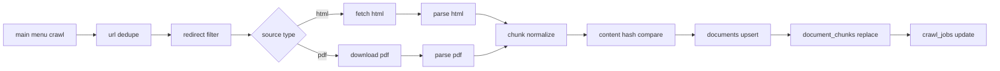

# Campus Copilot Phase 2 수집·파싱 파이프라인 설계

**날짜**: 2026-04-19
**범위**: Phase 2
**참조 기준**:
- Campus Copilot 아키텍처 문서: `docs/superpowers/specs/2026-04-08-architecture-design.md`
- DOM/셀렉터 기준선: `mur0327/hnu-ai@087e800` (`src/crawler.py`)

---

## 1. 목적

Phase 2의 목표는 호남대학교 공식 사이트에서 문서를 안정적으로 수집하고, HTML/PDF를 일관된 내부 문서 구조로 변환해 후속 인덱싱과 검색이 가능한 상태로 만드는 것이다.

이 단계에서는 다음을 완료한다.

- 메뉴 기반 URL 수집
- HTML / PDF 분기 처리
- 표 포함 HTML 파싱
- 텍스트 / 표 청킹 규칙 적용
- `content_hash` 기반 변경 감지
- PostgreSQL 적재용 문서·청크 구조 생성
- `worker` 스케줄 태스크와 실제 파이프라인 연결

이 단계에서 하지 않는 일은 다음과 같다.

- 답변 생성 로직 구현
- ChromaDB 검색 품질 튜닝
- 프론트엔드 UI 완성
- 관리자 화면 고도화

---

## 2. 설계 원칙

### 2-1. DOM 구조는 재사용하고 구현은 새로 작성한다

기존 `hnu-ai`는 호남대학교 사이트의 실제 DOM 구조를 검증한 기준선으로만 사용한다. 재사용 대상은 셀렉터와 페이지 탐색 규칙이며, 크롤링 아키텍처, 파싱기, 청킹 규칙, 저장 구조는 Campus Copilot 문서 기준으로 새로 구축한다.

### 2-2. source_type 별 파이프라인은 분리하되 저장 구조는 통합한다

HTML과 PDF는 수집 방식과 파서가 다르므로 파이프라인 내부 처리는 분리한다. 다만 최종 산출물은 동일한 `documents` / `document_chunks` 구조에 적재할 수 있는 공통 형태로 정규화한다.

### 2-3. Phase 2는 수집·가공·저장 준비까지 책임진다

Phase 2는 "어떤 문서를 어떤 청크로 저장할 것인가"를 결정하고 실제 적재까지 수행한다. 임베딩 검색, RAG 조합, 응답 생성은 Phase 4 책임으로 유지한다.

### 2-4. 표는 의미 단위를 유지한다

표는 셀과 행의 관계가 중요하므로 텍스트 청크처럼 자르지 않는다. HTML 표와 PDF 표 모두 "표 1개 = 청크 1개" 원칙을 유지한다.

---

## 3. 크롤링 기준선

### 3-1. 기준 URL

- 사이트 루트: `https://www.honam.ac.kr`
- 메뉴 진입 페이지: `/main`

### 3-2. DOM 셀렉터

`hnu-ai`에서 검증된 아래 DOM 구조를 Phase 2의 수집 기준선으로 사용한다.

- 메인 메뉴 루트: `ul#mainMenu`
- 메뉴 링크: `ul#mainMenu a:not([data-link="true"])`
- 본문 컨텐츠: `article.articleBox`
- 졸업학점 연도 선택: `select#selectYear`

### 3-3. URL 수집 규칙

메뉴 수집기는 `/main` 페이지에서 `ul#mainMenu`를 찾고, `data-link="true"` 속성이 없는 앵커만 대상으로 삼는다. 각 링크는 절대 URL로 정규화하고, URL 기준으로 중복 제거한다.

중복 제거 원칙은 다음과 같다.

- 같은 URL이 여러 메뉴에 노출되어도 한 번만 수집한다
- 첫 등장 순서를 유지한다
- 메뉴 텍스트는 해당 URL의 대표 `menu_path` 초기값으로 사용한다

### 3-4. 유효 URL 판별

호남대학교 사이트는 일부 링크가 실제 컨텐츠 대신 이동 안내 페이지로 연결된다. 따라서 메뉴 수집 후 각 URL을 한 번 점검하여 `<title>` 값이 `Page Moved` 인 문서는 크롤 대상에서 제외한다.

네트워크 요청은 `curl_cffi` 기반으로 수행하고, `impersonate="chrome120"`을 기본값으로 둔다.

### 3-5. PDF 대상

Phase 2에서는 일반 HTML 메뉴 외에 졸업학점 PDF도 함께 수집 대상으로 포함한다. PDF는 `select#selectYear`에서 연도 목록을 읽고, 각 연도 값으로 다운로드 URL을 구성한다.

초기 다운로드 규칙은 다음과 같다.

- 대상 엔드포인트: `/GraduateGrades/pdfdownload/{year}`
- 우선 범위: 최근 5개년
- 저장 대상 메타데이터: 연도, 원본 URL, 파일명, 수집 시각

---

## 4. 파이프라인 구조

### 4-1. 전체 흐름

### 4-2. 워커 책임 분리

`worker` 내부 책임은 다음과 같이 나눈다.

- `crawl.py`: 메뉴 탐색, URL 정규화, 리다이렉트 필터링, PDF 대상 식별
- `parse.py`: HTML/PDF 파싱, 표 추출, 청크 정규화
- `scheduler.py`: 주기 실행과 수동 실행 진입점
- `embed.py`: Phase 2에서는 직접 검색을 담당하지 않으며, 이후 Phase 4 인덱싱 연결을 위한 인터페이스만 유지
- `conflict_scan.py`: Phase 2에서는 실질 구현 범위에 포함하지 않는다

Phase 2의 핵심은 `crawl.py` 와 `parse.py` 에 집중한다.

---

## 5. HTML 처리 설계

### 5-1. 입력

HTML 처리의 입력은 다음 메타데이터를 포함한 페이지 단위 객체다.

- `url`
- `menu_path`
- `title` 후보
- 원본 HTML 문자열
- 수집 시각

### 5-2. 본문 추출

HTML은 전체 페이지를 그대로 파싱하지 않고 `article.articleBox` 범위만 본문으로 사용한다. 이 선택은 내비게이션, 푸터, 배너, 스크립트 등 검색 품질을 떨어뜨리는 요소를 제거하기 위한 것이다.

`article.articleBox`가 없는 페이지는 파싱 실패로 기록하고 건너뛴다. 이 경우 `crawl_jobs.error`에 누적 가능한 구조로 남긴다.

### 5-3. HTML 텍스트 파싱

본문 HTML은 `Crawl4AI` 기반 텍스트 추출을 기본 경로로 사용한다. 결과는 Markdown 성격의 텍스트로 정규화하고, 이후 텍스트 청킹기로 전달한다.

이 경로의 목적은 다음과 같다.

- 제목, 문단, 목록 구조 보존
- 일반 안내문 검색 품질 확보
- 테이블이 없는 페이지를 별도 예외 처리 없이 일관되게 처리

### 5-4. HTML 표 추출

본문 안의 표는 `BeautifulSoup`로 `article.articleBox table` 셀렉터를 기준으로 탐지한다. 각 표는 텍스트 파싱과 별도로 추가 추출한다.

표 추출 원칙은 다음과 같다.

- 표 1개를 청크 1개로 만든다
- 표 캡션, 직전 제목, 컬럼 헤더, 행 데이터는 `meta`에 넣을 수 있는 구조로 정리한다
- 표 본문은 검색 가능하도록 사람이 읽는 텍스트 형태도 함께 만든다

즉, HTML 한 페이지는 아래 두 종류의 청크를 동시에 생성할 수 있다.

- 텍스트 청크
- 표 청크

---

## 6. PDF 처리 설계

### 6-1. 분기 기준

URL이 PDF이거나, 별도 PDF 수집 대상으로 정의된 엔드포인트에서 내려받은 파일은 PDF 파서로 보낸다.

### 6-2. 파서 선택

PDF는 `opendataloader-pdf hybrid mode`를 사용한다. Campus Copilot의 기준은 Docling 기반 기존 구현을 대체하는 것이다.

선택 이유는 다음과 같다.

- 표 추출 정확도 우선
- 한국어 OCR 대응
- 향후 LangChain 계열 처리와의 연결 용이성

### 6-3. 배치 처리 원칙

`opendataloader-pdf`는 호출 비용이 높으므로, PDF는 페이지별 단건 처리보다 파일 묶음 기준 배치 처리를 우선한다. Phase 2에서는 먼저 안정적으로 수집과 변환이 되도록 구현하고, 배치 단위 최적화는 같은 Phase 2 안에서 고려하되 과도한 병렬화는 피한다.

### 6-4. PDF 청크 유형

PDF에서도 표와 일반 텍스트를 구분한다.

- 본문 텍스트: 헤더 기반 + 문자 수 기반 청킹
- 표: 표 1개 = 청크 1개

PDF 메타데이터에는 최소한 아래를 포함한다.

- `source_type = "pdf"`
- `year` 또는 문서 버전 정보
- 원본 파일명
- 페이지 범위 또는 표 위치 정보

---

## 7. 청킹 규칙

### 7-1. 텍스트 청크

텍스트는 아키텍처 문서 기준을 그대로 따른다.

1. `MarkdownHeaderTextSplitter`로 헤더 기준 1차 분할
2. `RecursiveCharacterTextSplitter`로 `size=500`, `overlap=100` 기준 2차 분할

텍스트 청크의 목표는 다음과 같다.

- 의미 단위를 최대한 유지
- 제목 정보 보존
- 임베딩과 검색에 적절한 길이 유지

### 7-2. 표 청크

표는 분할하지 않는다.

- HTML 표 1개 = 청크 1개
- PDF 표 1개 = 청크 1개
- `chunk_type = "table"`

표 청크의 `content`에는 LLM이 바로 읽을 수 있는 평문 버전을 넣고, `meta`에는 구조화된 헤더/행 정보나 위치 정보를 넣는다.

### 7-3. 청크 인덱스

각 문서 안의 청크는 `chunk_index` 오름차순으로 부여한다. 정렬 기준은 "원문에 등장하는 순서"를 따른다. 텍스트와 표가 혼합된 페이지도 원문 순서 기준으로 인덱스를 매긴다.

---

## 8. 변경 감지와 적재 규칙

### 8-1. content_hash

각 `document`는 파싱 직전의 원문 기준으로 `content_hash`를 가진다.

- HTML: `article.articleBox` 정규화 문자열 기준
- PDF: 다운로드된 파일 바이트 기준

해시가 이전과 같으면 해당 문서는 재파싱·재청킹·재적재하지 않는다.

### 8-2. documents 테이블 처리

문서 단위 업서트 기준은 `url` 이다.

업데이트 시 반영 값은 다음과 같다.

- `title`
- `menu_path`
- `category`
- `source_type`
- `content_hash`
- `crawled_at`
- `is_active`

### 8-3. document_chunks 처리

문서가 변경된 경우에는 해당 문서의 기존 청크를 교체한다.

- 기존 `document_chunks` 삭제
- 새 청크 일괄 삽입
- `chroma_id`는 Phase 4 연계를 고려해 nullable 유지

변경되지 않은 문서는 청크를 건드리지 않는다.

### 8-4. crawl_jobs 기록

각 크롤 실행은 `crawl_jobs`에 남긴다.

최소 기록 항목은 다음과 같다.

- 시작/종료 시각
- 상태: `running | completed | failed`
- `pages_crawled`
- `pages_changed`
- 오류 메시지 요약

---

## 9. 실패 처리와 운영 가드레일

### 9-1. 부분 실패 허용

한 페이지 파싱 실패가 전체 크롤 작업 실패가 되지 않도록 한다. 문서 단위 실패는 로그로 남기고 나머지 문서를 계속 처리한다.

### 9-2. 재시도 기준

네트워크 실패는 제한된 횟수만 재시도한다. DOM 구조 불일치나 파싱 예외는 재시도보다 오류 기록이 우선이다.

### 9-3. 셀렉터 변경 감지

`article.articleBox` 또는 `ul#mainMenu`를 찾지 못하는 경우는 단순 빈 응답으로 삼키지 않고 경고 수준 로그를 남긴다. 이 이벤트는 사이트 DOM 변경의 조기 신호로 본다.

### 9-4. 속도보다 안정성 우선

Phase 2 초기 구현에서는 과도한 동시성보다 안정적인 순차 흐름과 제한적 병렬 처리에 우선순위를 둔다. 특히 PDF 파싱은 비용이 높으므로 병렬성보다 재현성과 실패 복구 가능성을 우선한다.

---

## 10. 테스트 범위

Phase 2에서 필요한 테스트는 다음 네 축으로 나눈다.

### 10-1. 크롤링 단위 테스트

- 메뉴 HTML fixture에서 `ul#mainMenu` 링크 추출
- `data-link="true"` 링크 제외
- URL 중복 제거
- `Page Moved` 필터링

### 10-2. HTML 파싱 테스트

- `article.articleBox`만 본문으로 추출되는지 확인
- 표 없는 문서에서 텍스트 청크만 생성되는지 확인
- 표 있는 문서에서 텍스트 청크와 표 청크가 함께 생성되는지 확인

### 10-3. PDF 파싱 테스트

- PDF fixture에서 텍스트 청크 생성
- 표 청크 생성
- 메타데이터 구조 보존

### 10-4. 적재/변경 감지 테스트

- 동일 해시 문서는 건너뛰는지 확인
- 변경된 문서는 청크가 교체되는지 확인
- `crawl_jobs` 집계 값이 예상대로 기록되는지 확인

---

## 11. Phase 경계

이 문서에서 정의한 Phase 2의 완료 기준은 다음과 같다.

- 실제 사이트 메뉴에서 수집 대상 URL을 생성할 수 있다
- HTML과 PDF를 각각 파싱해 공통 문서 구조로 변환할 수 있다
- 텍스트와 표를 규칙에 맞게 청킹할 수 있다
- 변경 감지 후 PostgreSQL에 적재할 수 있다
- 스케줄러에서 실제 크롤 태스크를 실행할 수 있다

아래 항목은 완료 기준에서 제외한다.

- ChromaDB 검색 결과 검증
- BM25 결합 검색
- `/api/v1/chat` 실제 답변 생성
- 충돌 탐지 고도화

---

## 12. 구현 메모

구현 시 다음 방침을 따른다.

- `hnu-ai`에서는 DOM 셀렉터와 URL 수집 규칙만 참조한다
- HTML 파싱은 `Crawl4AI + BeautifulSoup` 조합으로 새로 작성한다
- PDF 파싱은 `opendataloader-pdf` 기준으로 새로 작성한다
- 청킹은 현행 아키텍처 문서의 규칙을 그대로 따른다
- 검색 및 응답 생성으로 범위가 새지 않도록 `worker` 내부 책임을 Phase 2로 제한한다
