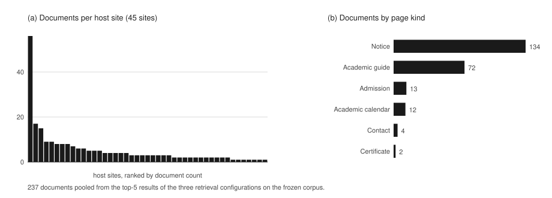
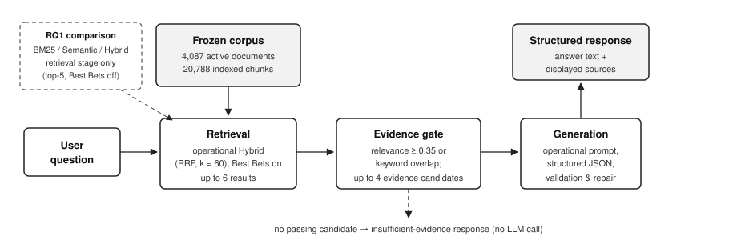
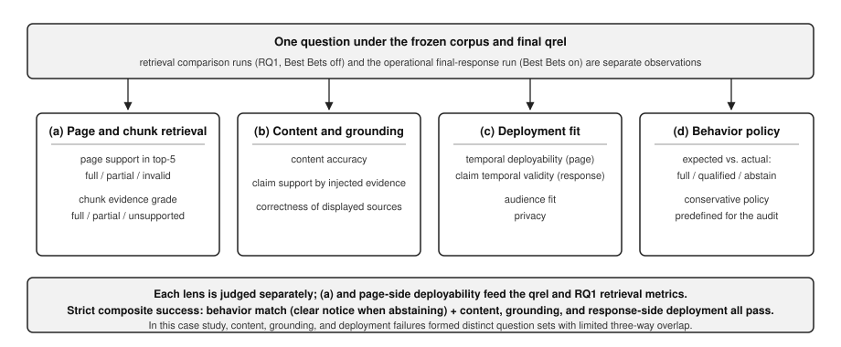
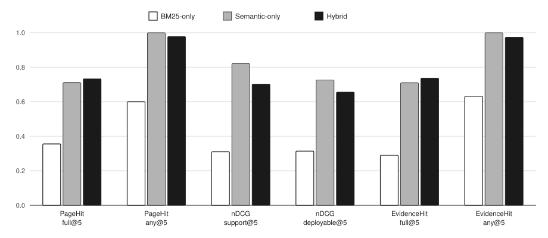
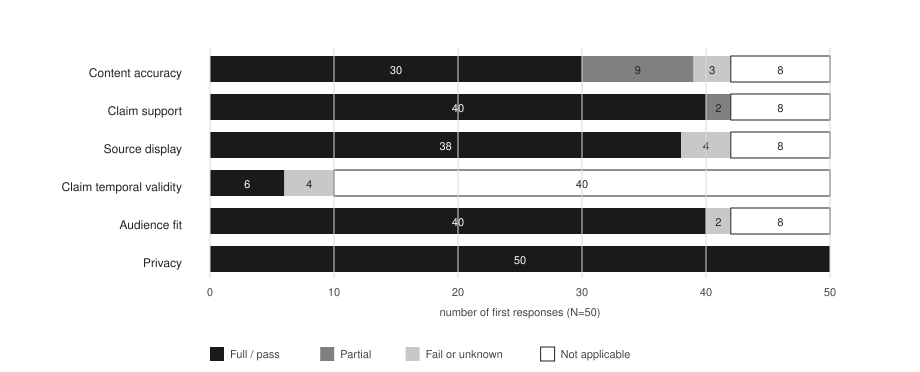

# 투고 원고 (HWPX 이관용 사본)

**상태: 지도교수 3차 피드백(2026-08-03) 반영 완료. 저자 정보·제목 확정 대기.**
**작성일 2026-07-17, 최종 갱신 2026-08-03.**

이 문서는 KMMS 투고 HWPX에 그대로 옮길 원고의 사실상 사본이며, 항목 순서는 학회 양식 샘플(guide/투고논문샘플(개정).hwp)을 따른다.
따라서 이 문서의 본문 형식은 00 형식 규칙이 아니라 학회 양식을 우선한다(영문 초록·표·그림 제목, 참고문헌 표기 등).
서술 내용의 근거·수치와 표현·한정 규칙은 [19-paper-master.md](19-paper-master.md)(본문과 §15 집필 통제)만 정본으로 따른다.
`[[ ]]` 표기는 미기입 자리표시자다.
본문 인용은 REFERENCE의 등장 순 번호 표기다(2026-07-23 최초 부여, 2026-08-03 서론 통계 문헌 삭제·구조 개편으로 [1]~[30] 전체 재부여·검증 완료, 키 대응은 git 이력 참조). 문헌을 추가·삭제하면 등장 순 번호를 재부여해야 한다. 기입된 쪽수와 저자진은 최종 감사에서 전수 재확인한다.
REFERENCE의 `*...*`는 HWPX에서 이탤릭으로 적용할 범위(학술지명·논문집명)를 표시한 것이며 별표 자체는 옮길 때 제거한다.
본문의 식 (1)~(2)는 HWPX 수식 편집기로 입력할 내용을 텍스트로 표기한 것이며, 그대로 복사하지 않고 수식 개체로 다시 입력한다.

---

<심사용 논문>

국문 제목: 대학 공식 문서 RAG의 검색 회수와 최종 응답 적합성 감사: 단일 기관 고정 50문항 사례 연구
(작업 제목. 국문·영문 후보 숏리스트는 [tmp/manuscript-round1/21-manuscript-merged.md](../../tmp/manuscript-round1/21-manuscript-merged.md), 최종 확정은 지도교수 검토에서)

이름: [[국문 저자명 — 지도교수 공저 확정(교신저자), 표기 순서 확인 필요]]
소속: [[국문 소속]]

영문 제목: [[국문 제목 확정 후 작성]]

영문 이름: [[영문 저자명]]
영문 소속: [[영문 소속]]

투고분야: 인공지능 / 머신러닝 / 딥러닝 (2026-07-20 지도교수 확정)

Corresponding Author: [[지도교수 영문 성명 — 교신저자 지도교수로 확정(2026-07-20)]]

- Address: [[영문 주소]]
- TEL: [[+82-]]
- FAX: [[해당 시]]
- E-mail: [[이메일]]

연구비 지원사항: [[해당 시 영문으로, 없으면 항목 삭제]]

---

국문 제목(본문면): 위와 동일
영문 제목(본문면): 위와 동일

## Abstract

University academic information is scattered across official pages that differ in applicable time and target audience, and retrieving a relevant document does not guarantee a deployable answer. This paper reports an offline case study that audits an operational retrieval-augmented generation (RAG) pipeline for university academic guidance on a frozen corpus with 50 purposively sampled questions. This study builds a three-level evaluation qrel that separately records page support, chunk-level evidence, temporal deployability, audience fit, and expected response behavior (full answer, qualified answer, or abstention), combining LLM first-pass judgments with label-blind human auditing followed by post-reveal adjudication. Using the same qrel, BM25-only, semantic-only, and hybrid retrieval are re-scored under shared operational post-processing, and final responses are judged on content accuracy, claim support, displayed sources, deployment fit, and behavior compliance. In this frozen run, no single retrieval configuration dominated all metrics. Strict composite success was 31/50 (62.0%). Under the conservative response policy predefined for this audit, over-answering occurred in 13 of 22 restricted-expectation questions while over-refusal was 0 of 31, and content, grounding, and deployment failures formed distinct question sets with limited three-way overlap. All results are restricted to this single-institution fixed case, and the published artifacts support artifact-level auditing of reported numbers.

Keyword: Retrieval-Augmented Generation, Evaluation, Deployability, Selective Answering, University Administrative Documents

## 1. 서  론

대학의 학사 정보는 학사 안내 페이지, 공지 사항, 학과 및 부속 기관 사이트에 흩어져 있으며, 같은 주제를 다루는 문서라도 적용 시점과 대상 집단이 서로 다르다. 본부 안내를 옮겨 실은 학과 페이지, 회차마다 갱신되는 모집 공지, 신입생이나 졸업 예정자와 같이 특정 집단만을 위한 안내가 하나의 코퍼스(corpus) 안에 공존한다. 이러한 분산은 본 연구의 동결 코퍼스에서도 확인된다. 후술할 50문항의 검색 결과에 등장한 문서 237개는 45개 호스트에 걸쳐 있으며, 문서가 가장 많은 호스트도 56개에 그치고 나머지는 학과와 부속 기관 사이트에 흩어져 있다. 페이지의 성격 또한 공지 134개, 학사 안내 72개, 입학 13개, 학사일정 12개 등으로 갈린다. 그 분포는 Fig. 1과 같으며, (a)는 호스트별 문서 수를, (b)는 페이지 성격별 문서 수를 나타내고 있다.

Fig. 1. Dispersion of the pooled documents on the frozen corpus: (a) documents per host site and (b) documents by page kind.

검색 증강 생성(Retrieval-Augmented Generation, RAG)[1]은 이러한 문서를 근거로 질문에 답하는 접근으로 대학 학사 안내에도 적용되고 있으나[2,3], 관련 문서의 검색에 성공하였다고 해서 사용자에게 그대로 내보낼 수 있는 답변이 보장되는 것은 아니다. 이는 검색 회수(retrieval recall)의 성공과 최종 응답의 적합성이 서로 다른 문제이기 때문이다. 문서 단위의 관련성 라벨이 하위 생성 품질을 보장하지 않는다는 지적이 제기되어 왔으며[4], 정답 페이지가 상위에 나타나더라도 실제 주입된 청크(chunk)가 질문의 핵심 주장을 지지하지 않을 수 있다. 또한 생성된 문장이 근거에 뒷받침되더라도 표시 출처가 부정확할 수 있고[5], 내용이 사실이더라도 지난 회차의 안내이거나 다른 집단을 위한 문서라면 현재 답변의 근거로 사용하기 어렵다[6]. 나아가 근거가 충분한지와는 별개로, 완전 답변, 제한 답변과 거절 중에서 적절한 행동을 선택하는지도 독립된 평가 대상이다[7,8]. 최근의 RAG 평가 연구는 이처럼 검색 품질, 귀속, 시간 유효성과 응답 행동을 각각 별도의 축으로 측정하는 방향으로 확장되고 있으나, 이러한 층위들을 하나의 점수로 합치면 실패의 위치를 특정할 수 없다.

이에 본 연구는 단일 대학의 공식 웹 문서 코퍼스와 운영 RAG 파이프라인을 동결하고, 연구 목적에 따라 선정한 고정 50문항에서 이러한 층위들을 분리하여 관찰하는 오프라인 사례 연구를 수행한다. 질문, 페이지 및 청크 세 수준의 평가 정답표(qrel)에 페이지 지지, 청크 근거, 시간 배포 가능성, 대상자 적합성과 질문별 기대 행동을 분리하여 기록하고, LLM 전량 초벌 판정과 초기 라벨 비공개 사람 감사, 전체 문항 검토와 불일치 조정을 거쳐 최종 평가 정답표를 확정한다. 같은 최종 평가 정답표로 BM25 단독, Semantic 단독과 Hybrid의 세 가지 검색 구성을 재채점하고, 운영 Hybrid 구성의 최종 응답은 통제 평가 화면에서 재현한 답변 텍스트와 표시 출처로 판정하며, 같은 질문을 세 번 실행하여 구조화 행동의 반복성을 진단한다. 모든 수치와 실패 빈도는 단일 기관에서 코퍼스와 평가 시점을 고정한 이 사례에 한정된다. 그 범위 안에서 본 연구는 층위를 분리한 감사가 실패의 위치를 특정하고 배포 가능성을 판단하는 데 필요함을 보인다.

본 논문의 구성은 다음과 같다. 2장에서는 관련 연구를 검토하고, 3장에서는 학사 안내 RAG 시스템의 구성과 실험 환경을, 4장에서는 연구 문제와 평가 방법을 기술한다. 5장에서는 결과를 보고하고 그 함의를 고찰하며, 마지막으로 6장에서는 결론과 향후 연구 방향을 제시한다.

## 2. 관련 연구

본 연구의 세 가지 검색 구성은 새로운 검색 기법이 아니라 확립된 기법의 조합이다. BM25는 확률적 관련성 프레임워크에 기반한 표준 어휘 검색으로[9], 질의 q와 문서 d의 점수를 식 (1)과 같이 계산한다.

$$score(q,d)=\sum_{t \in q} IDF(t)\cdot\frac{f(t,d)\,(k_1+1)}{f(t,d)+k_1\,(1-b+b\,|d|/avgdl)} \qquad (1)$$

여기서 f(t,d)는 질의 단어 t가 문서 d에 나타난 빈도, IDF(t)는 역문서 빈도, |d|와 avgdl은 문서 길이와 평균 문서 길이이며, k₁과 b는 빈도 포화와 길이 정규화를 조절하는 파라미터다. 점수가 질의 단어의 출현에서만 발생하므로 관련 문서라도 질의와 어휘가 다르면 점수를 얻지 못하며, 밀집 검색은 이중 인코더로 질의와 문단을 같은 벡터 공간에 사상하여 이러한 어휘 불일치를 보완할 수 있다[10]. 두 후보 목록의 결합에는 순위 역수 융합(Reciprocal Rank Fusion, RRF)을 사용하며, 문서 d의 결합 점수는 식 (2)와 같다[11].

$$RRF(d)=\sum_{r \in R}\frac{1}{k+rank_r(d)} \qquad (2)$$

여기서 R은 결합할 순위 목록의 집합, rank_r(d)는 목록 r에서 문서 d의 순위이며, 상수 k는 원 논문의 예비 실험에서 선택된 60을 본 연구의 데이터로 재조정하지 않고 그대로 사용한다[11]. 식 (2)의 점수는 각 목록의 순위 역수 합이므로, 한쪽 검색기에서만 상위인 문서는 다른 쪽 목록의 기여가 없어 결합 순위가 낮아질 수 있다. 실제로 여러 분야의 데이터셋을 모은 벤치마크에서 단일 검색기가 항상 우세하지 않다는 관찰[12], RRF가 파라미터에 민감하며 결합이 단일 시스템보다 나빠질 수 있다는 분석[13], 비영어 특수 도메인에서 융합 효과가 조건에 의존한다는 보고[14]는 두 검색기의 결합을 보편적 기본값으로 전제할 수 없음을 보여 준다. 이에 따라 본 연구는 검색 구성 비교를 특정 구성의 우월성 검증이 아니라 동일 운영 조건에서의 회수와 순위 품질 관찰로 설계한다.

RAG 평가 연구는 검색과 생성을 잇는 계보를 다층으로 판정해 왔다. KILT는 페이지 수준 출처 평가의 원류이며[15], 문서 단위 관련성 라벨이 하위 생성 품질과 어긋날 수 있다는 지적[4]은 본 연구가 페이지와 청크의 판정을 분리하는 출발점과 문제의식을 공유한다. TREC RAG 트랙은 관련성, 완전성과 귀속(attribution), 즉 생성된 문장을 확인된 출처로 되짚을 수 있는지를 결합한 다층 평가와 상위 결과를 합쳐 판정하는 관행을 보여 준다[16]. 참조 없는 LLM 자동 평가[17]는 충실성 측정에 집중하며 문서의 시간 배포 가능성과 같은 배포 맥락은 다루지 않는다. 근거 표시 축에서는 귀속 개념을 정식화한 연구[5], 인용(citation) 품질의 자동 평가[18]와 상용 생성형 검색 엔진의 실측[19]이 이어져 왔다. 본 연구는 이 축들에 배포 적합성 판정을 더한다. 주장을 지지하는 출처라도 시점이 만료되었거나 대상 집단이 다르면 배포에 부적합하다고 본다.

근거가 부족할 때 답변을 보류하는 문제는 도메인 이동 환경의 선택적 QA에서 다뤄졌고[20], RAG에서는 미응답 유형과 허용 응답을 평가하는 UAEval4RAG[7]와 문맥 충분성과 실제 행동을 교차하는 분석[21]이 제시되었다. 본 연구의 신규성 주장과 가장 가까운 경계는 MTRAG 계열이다. MTRAG는 다회전(multi-turn) 대화에서 질문을 answerable, partially answerable과 unanswerable로 구분하고 응답이 미응답(IDK)인지 판정하며[8], MTRAGEval은 여기에 부분 문항의 허용 판정과 불명확 질문에 대한 명확화 요구 판정을 더한 공동 평가 과제다[22]. 따라서 답변 가능성의 3단계 구분이나 기대와 실제 행동의 대조 자체는 본 연구의 신규 기여가 아니다. 다만 MTRAG 계열의 주 채점은 완전 답변 가능 문항과 부분 답변 가능 문항을 모두 답변한 경우로 함께 처리한다. 이와 달리 본 연구는 완전 답변, 제한 답변과 거절의 3단계 기대·실제 일치를 독립 채점한다. 여기에 시간과 대상자 적합성을 결합한 분해 구성이 동일하게 수행된 문헌은 확인하지 못하였다.

시간 맥락에 따라 답이 달라지는 질의는 SituatedQA가 정식화하였고[23], 빠르게 변하는 지식의 사실성 평가[24]와 낡은 정보가 RAG 정확도를 해친다는 실증[6]이 시간 축 평가의 계보를 이룬다. 반면 정부 정책 문서처럼 사용자의 조건에 따라 답의 적용 여부가 달라지는 질문은 조건부 답변 독해 과제로 제시되었으나[25], 문서의 대상자 적합성을 관련성 판정의 분리 축으로 둔 학술 문헌은 본 연구가 확인한 범위에서 찾지 못하였다. 대학 도메인 응용으로는 국내 학습관리시스템 질의응답 챗봇[2]과 해외 대학 학생 지원 에이전트[3] 등 사례가 늘고 있으나, 확인한 범위에서 이들의 평가는 검색 성공률, 사용성이나 안전성 등 단일 축에 머무르며 본 연구와 같은 분해 감사는 확인하지 못하였다.

고정된 시스템들의 상위 결과를 합쳐 판정하는 pooled qrel은 확립된 평가 관행이지만 pool 밖 문서에 대한 완전성을 보장하지 않는다[26]. LLM을 관련성 판정에 활용하는 연구는 비용 효율과 시스템 순위 수준의 상관을 보고하는 한편[27], LLM 판정이 사람 판정을 대체하기 어렵고[28] 서로 다른 LLM 판정기가 사람보다 자기들끼리 더 강하게 합의한다는 공유 편향 경고도 제기되었다[29]. LLM을 보조 수단으로 두고 사람이 고위험 사례를 감사해야 한다는 관점[30]에 따라, 본 연구는 LLM 전량 초벌 뒤 초기 라벨 비공개 사람 감사와 조정을 결합하되 이 절차를 방법론적 기여가 아니라 제한된 pool에서의 보수적 사례 연구 절차로 사용한다.

## 3. 학사 안내 RAG 시스템

### 3.1 전체 시스템 구성

본 연구에서 구현한 학사 안내 RAG 시스템은 대학 구성원의 학사 문의에 공식 문서를 근거로 답하는 질의응답 시스템이다. 이 시스템은 단일 대학의 공식 웹 페이지와 문서를 수집한 뒤 HTML과 PDF를 파싱하여 텍스트와 표 청크로 분할하며, 검색 입력에는 청크 본문과 함께 문서 제목과 메뉴 경로를 사용한다. 문서와 청크는 PostgreSQL에 저장하고, 활성 문서의 비어 있지 않은 청크를 의미 검색용 벡터 저장소(ChromaDB)와 BM25 색인에 등록한다.

BM25 검색은 식 (1)의 점수를 한국어 경량 토큰화 결과에 적용하며 제한된 목록의 도메인 동의어 확장을 사용하고, Semantic 검색은 Voyage 임베딩으로 질문 벡터를 생성하여 벡터 저장소에서 유사 청크를 조회한다. Hybrid 검색은 두 후보 목록을 식 (2)의 RRF로 결합하며 상수 k는 60이다[11]. RRF 점수는 순위 결정에 사용하고, 의미 점수와 BM25 점수의 가중 결합으로 만든 관련도는 근거 선택 단계의 절대 관련도 판정에 사용하며, 상세 질문에서는 제목형 청크 뒤의 표 청크를 보강하고 중복 결과를 제거한다.

검색 결과는 문서 단위로 묶어 최대 네 개의 근거 후보로 제한한다. 후보는 관련도가 0.35 이상이거나 질문과 직접 학사 키워드가 하나 이상 겹칠 때 통과하며, 통과 후보가 없으면 시스템은 근거 부족 응답을 반환한다. 후보가 있으면 운영 프롬프트가 답변 가능 상태(answerability), 요약, 절차, 주의 사항과 사용 출처 번호를 구조화된 JSON으로 생성하도록 요청하며, 백엔드는 JSON을 검증하고 복구한 뒤 실제 사용된 번호에 해당하는 출처만 최종 응답에 표시한다. 학사 안내 RAG 시스템의 전체 구성은 Fig. 2와 같으며, 사용자 질문 입력부터 구조화 응답 생성에 이르는 처리 과정을 나타내고 있다.

Fig. 2. Evaluation-target path from user question to structured response on the frozen corpus.

### 3.2 실험 환경

검색 구성 비교는 같은 코퍼스에서 BM25 단독, Semantic 단독과 Hybrid를 연속적으로 실행한 동결 결과를 사용한다. 단일 검색 구성은 해당 검색기만 활성화하고 관련도 결합 가중치를 1.0으로 두며, 상세 컨텍스트 확장과 중복 제거 등 공통 운영 후처리는 유지한다. 큐레이션 고정 결과(Best Bets)만 비활성화하고 각 구성의 최종 반환 결과 중 상위 다섯 건을 채점한다. 최종 응답 실행은 운영 구성 그대로 Best Bets를 활성화한 상태에서 수행하였으며, 실행 시점과 동결 기록을 포함한 세부 실행 조건은 Table 2의 각주에 정리한다. 코퍼스는 실행 전후의 해시 지문 비교로 동결을 확인하였고, 동결 시점 기준 활성 문서 4,087개와 색인 청크 20,788개를 포함한다. 평가는 이 동결 시점에 고정되며, 이후의 문서 갱신에 따라 같은 질문의 기대 행동과 결과가 달라질 수 있다. 평가에 사용한 시스템 구성 요소와 검색 설정은 Table 1과 같다.

Table 1. System components and retrieval configuration of the evaluation target

| Category | Specification |
| --- | --- |
| Answer LLM | gemini-3-flash-preview |
| Embedding model | voyage-4-large |
| Vector store | ChromaDB |
| Document store | PostgreSQL |
| Rank fusion | RRF (k=60) |
| Candidates per retriever | 20 |
| Returned results | up to 6 |
| Evidence candidates | up to 4 (after document grouping) |

## 4. 평가 방법

### 4.1 평가 질문 및 정답표 구성

3장의 시스템은 관련 문서의 검색에 성공하더라도 시점이 만료되었거나 대상 집단이 다른 문서를 근거로 답할 수 있으므로, 검색 성공률만으로는 실제 안내에 사용할 수 있는지 판단하기 어렵다. 따라서 본 연구는 검색 회수와 최종 응답의 품질을 분리하여 평가하며, 연구 문제를 다음과 같이 설정한다. RQ1은 공통 후처리를 공유하는 세 가지 검색 구성이 페이지 및 근거 회수와 순위 품질에서 어떤 차이를 보이는지 검토한다. RQ2는 최종 응답에서 내용 정확성, 근거 축과 배포 적합성 실패가 어떻게 구분되고 어떤 오류 유형으로 나타나는지 분석한다. RQ3은 최종 응답이 기대 행동인 완전 답변, 제한 답변과 거절을 얼마나 따르며 불일치가 어느 방향으로 나타나는지 살펴본다.

평가 질문은 학사 행정 영역에서 연구 목적에 따라 선정한 50문항으로, 여섯 문항은 2026년 7월 재학생 설문 응답에서 유도하고 나머지 44문항은 학사 행정 범위와 알려진 실패 유형이 포함되도록 연구자가 작성하였다. 설문은 자발적 참여의 자유 서술 응답으로 수집하였으며, 응답 원문이 아닌 질문 주제만 평가 문항으로 옮기고 식별 정보는 문항 구성과 평가 산출물에 사용하지 않았다. 최종 평가 정답표 기준 기대 행동의 분포는 완전 답변 28문항, 제한 답변 3문항과 거절 19문항이다. Q011과 Q035는 같은 질문이므로 50문항 결과를 주 결과로 유지하고, Q035를 제외한 49문항 결과를 중복 민감도 분석으로 함께 보고한다. 질문 집합은 무작위 표본이 아니며, 같은 집합의 초기 실패가 시스템 개선에도 사용되었다.

평가 정답표(qrel)는 질문, 페이지 및 청크의 세 수준으로 구성한다. 질문 수준에는 기대 행동과 주된·부차적 사유를, 페이지 수준에는 지지 정도, 시간 배포 가능성과 대상자 적합성을, 청크 수준에는 근거 강도와 근거 유형을 기록한다. 페이지 지지는 완전 지지(full), 부분 지지(partial)와 비지지(invalid)의 세 가지다. 시간 배포 가능성은 유효(current), 만료(stale)와 불명(unknown)으로 구분한다. 대상자 적합성은 일치(match), 불일치(mismatch)와 불명(unknown)으로 나눈다. 청크 근거는 완전 근거와 부분 근거만 양성 라벨로 부여하며, 근거 유형은 본문 청크(text chunk)와 페이지 도달(page navigation)로 나눈다. 세 수준의 판정 축과 최종 응답의 판정 축은 Table 2와 같다.

Table 2. Evaluation axes of the three-level qrel and the final-response rubric

| Level | Axis | Labels |
| --- | --- | --- |
| Question | Expected behavior | full answer / qualified answer / abstention |
| Question | Primary reason (non-full-answer) | missing required claim / acquisition failure / stale / absent from pool / audience mismatch / personalized / policy exclusion |
| Page | Support | full / partial / invalid |
| Page | Temporal deployability | current / stale / unknown |
| Page | Audience fit | match / mismatch / unknown |
| Chunk | Evidence grade | full / partial (no positive label = unsupported) |
| Chunk | Evidence type | text chunk / page navigation |
| Response | Behavior | full answer / qualified answer / abstention |
| Response | Quality axes | content accuracy / claim support / source display / claim temporal validity / audience / privacy |

Note: run conditions — Best Bets on for final-response runs and off for the RQ1 top-5 comparison; fixed question order (seed 20260715); response cache bypassed; sequential execution; no provider sampling override; qrel frozen 2026-07-14, runs executed 2026-07-15; corpus frozen (4,087 active documents, 20,788 indexed chunks). Runs recorded at git commit a718a76a; corpus and artifact fingerprints (database, vector store, BM25 index) are pinned in the published run manifest.

판정 후보는 세 가지 검색 구성의 동결 상위 다섯 건 합집합에 이전 판정과 예비 평가에서 관련성이 확인된 항목을 더한 pool로 구성하였다. 세 가지 구성의 실행에서 상위 다섯 건에 등장한 페이지와 청크는 채점 전에 모두 판정하였다. 이 pool은 관찰된 검색 결과를 공정하게 비교하기 위한 것이며 코퍼스 전체를 망라하는 판정이 아니다. 수집 범위 밖의 목표 출처는 별도 목록에 기록하였다. 한편, 최종 응답의 운영 검색은 Best Bets를 포함한 상위 여섯 건을 사용하므로, 운영 검색이 실제로 주입한 근거 중 pool 밖 항목인 페이지 2쌍과 청크 2개(Q010, Q049)는 미판정으로 남는다. 검색 지표는 상위 다섯 건의 완전 판정을 강제하므로 이 차이의 영향을 받지 않으며, 잔여 영향은 해당 두 문항의 최종 응답 판정에서 참조 근거의 완전성에 한정된다.

판정은 Table 3과 같이 세 단계로 진행하였다. 먼저 두 LLM(Claude Fable 5와 GPT 5.6 Sol)이 고정 코드북으로 후보 전량의 초벌 판정을 생성하고 그 결과를 동결하였다. 다음으로 사람 검토자가 초기 라벨, 선정 사유, 검색 방식과 순위 정보를 보지 않은 상태에서, 사전 정의한 고위험 표적 67묶음과 고정 시드로 추출한 층화 표본 20묶음을 재판정하였다. 마지막으로 라벨을 공개한 상태에서 같은 저자가 차이를 조정하고 질문 50개의 기대 행동과 사유를 전량 확인하였다.

각 단계의 감사 규모와 조정 전 원시 차이, 최종 채택 변경도 Table 3에 함께 정리하였다. 최종 발행본은 페이지 판정 424행, 청크 근거 626행과 질문 판정 50행으로 구성되며, 발행 직후 12개 불변 조건 검사를 통과하고 세 가지 검색 실행의 상위 다섯 건에 미판정 후보가 없음을 확인하였다. 원시 차이는 사람 재판정과 초벌 라벨의 최초 불일치 수로서 초벌 오류율이나 평가자 간 불일치율이 아니다. 감사 대상이 고위험 중심 표본이므로 이 절차는 최종 평가 정답표 전체의 정확도나 평가자 간 신뢰도를 추정하지 않으며, 3단계의 최종 조정은 초기 라벨을 본 상태에서 이루어졌다.

Table 3. Three-stage judgment procedure and audit outcome

| Stage | Judge | Scope | Initial labels | Outcome |
| --- | --- | --- | --- | --- |
| 1. First-pass judgment | Two LLMs (Claude Fable 5, GPT 5.6 Sol) | All pooled candidates for 50 questions | — | First-pass labels, frozen |
| 2. Label-blind human audit | Single author | 67 high-risk targets + 20 stratified samples | Hidden | Raw differences: pages 43, evidence grades 34 (targets); 7 and 7 (samples) |
| 3. Adjudication and full question review | Same author | All differences + all 50 questions | Revealed | Adopted changes: 3 page pairs, 4 evidence pairs, 2 expected behaviors, 1 secondary reason |

### 4.2 응답 정책과 최종 응답 평가

질문별 기대 행동은 완전 답변, 제한 답변과 거절의 세 가지이며, 완전 답변이 어려운 경우의 주된 사유는 필수 주장 부족, 수집 실패, 시점 만료, 판정 후보 pool 내 근거 부재, 대상자 불일치, 개인화와 정책 제외의 일곱 가지로 구분하였다. 확정된 50문항에서는 개인화와 정책 제외를 제외한 다섯 가지 사유만 관찰되었으며, 완전 답변 이외가 기대되는 22문항의 주된 사유 분포는 필수 주장 부족 8, 수집 실패 5, 시점 만료 4, 판정 후보 pool 내 근거 부재 4와 대상자 불일치 1이다.

기대 행동은 시스템의 보수적 배포 가능성을 감사하기 위하여 연구자가 사전 정의한 정책 라벨이며, 대학이 승인한 상담 정책이나 사용자 선호를 대표하지 않는다. 따라서 기대 행동과 실제 행동의 불일치는 오답률이 아니라 이 정책 기준과의 불일치로 해석한다.

최종 응답 평가는 운영 Hybrid 구성이 반환한 질문별 첫 번째 정상 구조화 응답 50건을 대상으로 하며, 브라우저 화면 배치, 상태 표시, 링크 이동과 후속 대화를 제외하고 최종 API 응답의 답변 텍스트와 표시 출처를 재현한 통제 평가 화면에서 판정한다. 판정 축은 실제 응답 행동과 여섯 가지 품질 축이다. 품질 축은 내용 정확성, 근거 축인 내용 지지(claim support)와 표시 출처(source display), 배포 적합성 축인 응답 주장 시간 유효성, 대상자 적합성과 개인정보로 나뉜다. 이때 응답의 시간 축은 문서의 시간 축과 구분된다. 최종 평가 정답표의 시간 배포 가능성이 문서를 현재 안내에 사용할 수 있는지를 보는 반면, 응답 주장 시간 유효성은 응답이 실제로 말한 시간 민감 주장이 유효한지를 본다.

판정 기준, 프롬프트, 최종 평가 정답표와 실행 원본 해시는 응답 판정 전에 동결하였다. 판정은 단계별 마스킹으로 진행하였다. 첫 단계에서는 질문, 답변 텍스트와 표시 출처만 보고 실제 행동을 판정하여 잠근 뒤, 실제 주입 근거와 라벨을 가린 최종 평가 정답표 참조 묶음을 공개하여 품질 축을 판정하고, 모든 축을 잠근 뒤에만 기대 행동과 반복 결과를 공개하였다. 첫 응답 50건은 단일 저자가 이 절차로 판정하였다. 50문항을 같은 고정 순서로 세 번 실행하여 150개 정상 응답을 얻었으며, 첫 응답만 본평가에 사용하고 두 번째와 세 번째 응답은 파이프라인이 반환한 구조화 행동의 반복 일치 진단에만 사용하였다.

엄격한 종합 성공은 다음 조건을 모두 만족한 응답만 계수한다. 정상 응답이 기대 행동과 일치하고, 거절이면 명확한 근거 부족 고지가 있으며, 내용이 완전 정확하거나 순수 거절로 해당 없음이어야 한다. 또한 실제 주입 근거에 대한 내용 지지가 완전하거나 해당 없음이고, 표시 출처가 완전하거나 해당 없음이며, 응답 주장 시간 유효성, 대상자 및 개인정보 배포 적합성을 모두 통과해야 한다. 부분 정확과 부분 지지는 엄격한 종합 성공에 포함하지 않고 별도로 보고한다. 이 정의는 사전 동결한 다축 기준의 결합 준수이며 일반 정확도나 실제 사용자 성공률이 아니다.

분리 평가의 전체 구성은 Fig. 3과 같다. Fig. 3의 (a)는 페이지·청크 회수, (b)는 내용 정확성과 근거, (c)는 배포 적합성, (d)는 행동 정책 준수의 판정을 각각 나타낸다.

Fig. 3. Decomposed evaluation lenses under the frozen corpus and qrel: (a) page and chunk retrieval, (b) content and grounding, (c) deployment fit, and (d) behavior policy.

## 5. 검색 회수와 최종 응답 평가 결과

### 5.1 검색 구성 비교 (RQ1)

본 장에서는 4장의 절차로 얻은 결과를 보고한다. 5.1은 검색 구성 비교(RQ1), 5.2는 최종 응답 실패 분석(RQ2), 5.3은 응답 정책 준수 분석(RQ3)을 다루며, 각 결과의 함의를 함께 고찰한다.

검색 평가는 다음의 여섯 가지 지표를 사용하며, 지표별 분모는 질문 특성에 따라 다르다. PageHit full@5는 완전 지지 페이지가, PageHit any@5는 완전 또는 부분 지지 페이지가 상위 다섯 건에 하나 이상 포함된 질문의 비율이다. nDCG support@5는 페이지 지지에 완전 지지 2, 부분 지지 1, 비지지 0의 이득을 주고 같은 URL의 첫 청크에만 이득을 인정하는 순위 품질이며, nDCG deployable@5는 시간 배포 가능성이 유효이고 대상자가 일치인 페이지에만 지지 이득을 주는 순위 품질이다. EvidenceHit full@5는 완전 본문 청크 근거의 회수를, EvidenceHit any@5는 완전 또는 부분 근거의 회수를 측정한다. 지지 페이지가 있는 질문은 45개, 현재 배포 가능한 페이지가 있는 질문은 39개, 본문 청크 근거로 평가하는 질문은 38개이며, 페이지 도달 자체가 답인 질문은 근거 지표의 분모에서 제외한다.

이 동결 검색 실행에서는 지표별 최고 구성이 서로 달랐다. 세 가지 구성의 지표별 결과는 Table 4와 같으며, Fig. 4는 이를 막대그래프로 나타내고 있다. Hybrid는 완전 지지 페이지와 완전 본문 근거를 하나 이상 회수한 비율이 가장 높았으나 그 차이는 Semantic 대비 각각 한 문항 규모였고, Semantic은 부분 지지를 포함한 회수율과 두 nDCG에서 가장 높았다. BM25 단독은 모든 지표에서 가장 낮았다. Hybrid가 완전 근거 회수를 추가한 유일한 문항(Q005)의 후보는 BM25가 제공하였으나 해당 페이지는 시점이 만료되어 기대 행동이 거절이며, Semantic만 부분 지지 페이지를 회수한 문항(Q024)에서는 BM25의 비관련 결과가 결합되면서 해당 페이지가 상위 다섯 건 밖으로 밀렸다. 이 실행에서는 완전 근거의 최소 한 건 회수와 전체 관련 근거의 순위 품질 사이의 상충 관계(trade-off)가 관찰되었으며, 이를 융합의 일반적 기제나 인과 효과로 해석하지 않는다.

Table 4. Retrieval metrics of the three configurations on the frozen run

| Configuration | PageHit full@5 (N=45) | PageHit any@5 (N=45) | nDCG support@5 (N=45) | nDCG deployable@5 (N=39) | EvidenceHit full@5 (N=38) | EvidenceHit any@5 (N=38) |
| --- | ---: | ---: | ---: | ---: | ---: | ---: |
| BM25-only | 0.3556 (16/45) | 0.6000 (27/45) | 0.3104 | 0.3138 | 0.2895 (11/38) | 0.6316 (24/38) |
| Semantic-only | 0.7111 (32/45) | 1.0000 (45/45) | 0.8216 | 0.7264 | 0.7105 (27/38) | 1.0000 (38/38) |
| Hybrid | 0.7333 (33/45) | 0.9778 (44/45) | 0.7023 | 0.6560 | 0.7368 (28/38) | 0.9737 (37/38) |

Fig. 4. Visual comparison of the six retrieval metrics across the three configurations (values from Table 4).

중복 문항인 Q035를 제외한 49문항 분석에서도 모든 지표의 구성 순위가 유지되었고 최대 절대 변화는 0.0192였다. 같은 동결 검색 결과를 LLM 초벌 정답표로 채점한 감사 전후 민감도에서도 여섯 가지 지표의 구성 순위가 유지되었으며 최대 절대 변화는 0.0526이었다. 이는 채택된 조정 범위에 대한 민감도이며 최종 평가 정답표가 참임을 검증하는 것은 아니다. 다만 두 민감도 분석에서 구성 순위가 모두 유지되었다는 점은 관찰된 구성 간 차이가 중복 문항 처리나 정답표 조정 범위에 좌우되지 않았음을 나타낸다. 한편 RQ1의 비교는 Best Bets를 비활성화한 상위 다섯 건 기준이고 최종 응답 실행은 Best Bets를 활성화한 운영 조건이므로, 두 실험은 서로 조건이 다른 각각의 관찰로 읽는다.

이 상충 관계를 어떻게 볼지는 생성 단계의 설계에 따라 달라진다. 생성 단계가 여러 근거 후보를 함께 받는 현재 설계에서는 완전 근거를 최소 한 건 확보하는 쪽이 상대적으로 중요할 수 있으나, 본 연구는 검색 구성별 최종 응답 품질을 직접 비교하지 않았다. 다만 이 실행에서 구성 간 우열이 기준 지표에 따라 뒤바뀌었다는 점은, 검색 성능을 하나의 지표로 요약할 때 다른 축의 손실이 함께 보고되어야 함을 나타낸다.

### 5.2 최종 응답 실패 분석 (RQ2)

첫 응답 50건은 대부분의 품질 축에서 완전 충족으로 판정되었고, 실패는 축마다 다른 크기로 나타났다. 내용 정확성은 완전 정확 30건, 부분 정확 9건, 부정확 3건과 해당 없음 8건이었으며, 실제 주입 근거의 내용 지지는 완전 지지 40건, 부분 지지 2건과 해당 없음 8건, 표시 출처는 완전 38건, 부정확 4건과 해당 없음 8건으로 나타났다. 응답 주장 시간 유효성은 유효 6건, 만료 3건, 불명 1건과 해당 없음 40건, 대상자 적합성은 일치 40건, 불일치 1건, 불명 1건과 해당 없음 8건이었고, 개인정보는 50건 모두 안전이었다. 여섯 축의 분포는 Fig. 5와 같으며, 각 막대는 첫 응답 50건이 완전 충족, 부분, 미충족 또는 불명, 해당 없음으로 나뉘는 비율을 나타내고 있다.

Fig. 5. Distribution of the six response quality axes over the 50 first responses.

순수 거절 8건은 사실 안내와 표시 출처가 없어 정확성, 근거와 출처 축을 해당 없음으로 판정하였다. 응답 주장 시간 유효성의 해당 없음 40건은 응답이 시간 민감 주장을 하지 않은 경우로, 문서 수준의 시간 배포 가능성과는 별개의 축이다. 개인정보 축에서는 판정된 위험 응답이 0건이었다. 다만 위험 사례가 없었으므로 이 축은 위험 탐지 성능이 아니라 이번 실행에서 위험 응답이 관찰되지 않았다는 사실만을 기록한다.

엄격한 기준의 실패 집합은 50문항 중 내용 정확성 12문항, 결합 근거 축 6문항과 배포 적합성 6문항이었다. 결합 근거 축의 실패는 내용 지지가 부분적인 2문항(Q016, Q031)과 내용 지지는 완전하지만 표시 출처가 부정확한 4문항(Q002, Q020, Q033, Q041)으로 나뉘며, 이는 주입 근거가 답을 뒷받침하는 것과 그 출처가 올바르게 표시되는 것이 별개의 문제임을 보여 준다. 내용 정확성과 결합 근거, 내용 정확성과 배포 적합성의 교집합은 각각 4문항이었고, 세 축을 모두 실패한 문항은 Q016과 Q031뿐이었다. 교집합이 제한적이므로 세 축은 같은 50문항에서 서로 다른 실패를 나타낸다.

서로 다른 축이 각각 드러낸 대표 사례는 Table 5와 같다. 표시 출처만 실패한 사례(Q002), 근거에 충실하지만 지난 회차 정보여서 배포 적합성만 실패한 사례(Q040), 대학원용 정보를 학부 질문에 적용하여 여러 축이 함께 실패한 사례(Q016)와 품질 축을 통과하고도 조건을 특정하지 않고 안내하여 부분 정확에 그친 사례(Q025)가 각각 관찰되었다.

Table 5. Representative failure cases across evaluation axes

| ID | Question (gist) | Expected → actual | Failed axes | Judgment note |
| --- | --- | --- | --- | --- |
| Q002 | When is the re-enrollment application period? | full → full | combined grounding (source display) | content correct and fully supported, but a displayed source was incorrect |
| Q040 | When does early admission application start? | abstain → full | deployment fit (temporal) | content matched the evidence, but the notice was from a past admission cycle |
| Q016 | Where should I ask for admission counseling? | qualified → full | content, grounding, deployment (audience) | graduate-school information applied to an undergraduate admission question |
| Q025 | Which required courses must I take to graduate? | qualified → full | content accuracy (partial) | required courses stated without cohort- and department-specific conditions |

### 5.3 응답 정책 준수 분석 (RQ3)

기대 행동과 실제 행동의 행렬 및 기대 행동별 엄격한 종합 성공은 Table 6과 같다. 행동이 일치한 문항은 36/50이었고, 내용, 근거, 출처와 배포 조건까지 모두 충족한 엄격한 종합 성공은 31/50(62.0%)이었다. 기대 행동별로는 완전 답변 기대 문항이 22/28(78.6%)로 가장 높았고 제한 답변과 거절 기대 문항은 각각 1/3과 8/19(42.1%)였다. Q035를 제외한 민감도 분석에서는 30/49(61.2%)였다.

Table 6. Expected versus actual behavior and strict composite success

| Expected \ Actual | Full answer | Qualified answer | Abstention | Strict success |
| --- | ---: | ---: | ---: | ---: |
| Full answer (28) | 27 | 1 | 0 | 22/28 (78.6%) |
| Qualified answer (3) | 2 | 1 | 0 | 1/3 |
| Abstention (19) | 6 | 5 | 8 | 8/19 (42.1%) |
| Total (50) | 35 | 7 | 8 | 31/50 (62.0%) |

행동 오류는 주로 한 방향으로 나타났다. 제한 또는 거절이 기대되는 22문항 중 13문항(59.1%)에서 기대된 수준을 넘어 답변한 과잉답변이 관찰된 반면, 완전 답변 또는 제한 답변이 기대되는 31문항에서 거절한 과잉거절은 0건이었고 불필요한 제한 답변은 1/28이었다. 13문항의 내부 구성은 내용, 근거, 출처와 배포 축을 모두 통과한 정책 전용 불일치(policy-only mismatch) 3문항(Q003, Q005, Q030)과 하나 이상의 품질 축 실패를 동반한 실질 실패(substantive failure) 10문항으로 나뉜다. 이 구분은 공개 판정 산출물에서 재집계한 파생값이다. 과잉답변은 사전 정의한 보수적 응답 정책과의 불일치이며 그 자체로 오답이나 위험 답변을 뜻하지 않고, 이 방향성은 현재 질문 집합과 구성에 한정되는 관찰이다.

파이프라인이 반환한 구조화 응답 행동의 반복 일치도는 사람이 응답 텍스트를 보고 판정한 실제 행동과 다른 변수로, 사람 판정 행동의 반복 검증이나 답변 내용의 안정성이 아니라 시스템이 반환한 답변 가능 상태(answerability) 필드 범주가 세 번의 실행에서 얼마나 일치하였는지를 나타낸다. 같은 질문에 대한 세 번의 반복 실행에서 이 값은 46/50(92.0%)이었고, 달라진 문항은 Q008, Q029, Q039와 Q041이었다.

응답 정책 준수는 내용 정확성이나 근거 축과 구분되는 축으로 나타났다. 최종 응답에서 내용 정확성, 결합 근거와 배포 적합성의 실패 집합은 제한적으로만 겹쳤고, 행동 오류는 과잉거절이 아니라 과잉답변 방향으로 나타났다. 특히 과잉답변 13문항 가운데 정책 전용 불일치 3문항은 내용과 근거, 출처와 배포 축을 모두 통과하고도 정책 기준을 벗어난 경우였다. 이 빈도가 실제 서비스 질의 분포의 과잉답변률을 추정하지는 않지만, 이러한 문항은 품질 축의 판정만으로는 드러나지 않으므로 응답 행동을 별도의 축으로 기록해야 함을 나타낸다.

## 6. 결  론

본 연구는 단일 대학의 공식 문서 코퍼스와 운영 RAG 파이프라인을 동결하고, 연구 목적에 따라 선정한 고정 50문항에서 검색 회수와 최종 응답의 내용, 근거, 배포 및 행동 적합성을 분리하여 관찰하였다. 세 수준으로 분해한 최종 평가 정답표와 감사 절차를 구성하였고, 이 동결 실행에서 검색 지표별 최고 구성이 서로 달랐으며, 최종 응답의 내용 정확성, 결합 근거와 배포 적합성 실패가 서로 다른 문항 집합으로 나타나고 행동 오류가 과잉답변 방향으로 관찰되었음을 보고하였다. 이러한 결과는 검색 성공률이나 단일 정확도만으로는 기관 안내 서비스의 배포 가능성을 판단하기 어렵고, 응답 정책 준수를 별도의 축으로 감사할 필요가 있음을 이 사례 안에서 보여 준다.

다만 본 연구는 단일 기관의 고정 코퍼스와 연구 목적에 따라 선정한 50문항을 사용하였고 같은 질문 집합의 초기 실패가 시스템 개선에도 사용되었으므로, 보고한 빈도와 비율은 다른 기관, 언어, 모델이나 서비스로 일반화할 수 없는 고정 사례 감사로 해석해야 한다. 또한 최종 평가 정답표는 pool 기반 판정으로 코퍼스 전체를 망라하지 않으며, LLM 초벌과 단일 저자 중심의 고위험 감사는 독립적인 사람 전량 이중 판정이 아니라는 보완할 점이 남아 있다. 완전한 재실행 재현을 보장하지는 않지만, 본 연구는 최종 평가 정답표, 세 가지 검색 구성의 동결 출력 공개본, 마스킹 응답과 판정 및 집계 결과의 해시 계보를 공개하여 보고한 수치를 산출물 수준에서 감사할 수 있도록 하였다.

이에 향후 연구에서는 검색 구성별 최종 응답 품질을 비교하고, 코퍼스를 확장하여 다기관 검증을 수행할 계획이다. 아울러 독립 평가자에 의한 신뢰도 측정, 시점 갱신 기능의 인과 효과 평가와 거절 정책의 사용자 수용성 검증으로 범위를 넓히고자 한다.

## REFERENCE

[1] P. Lewis, E. Perez, A. Piktus, F. Petroni, V. Karpukhin, N. Goyal, et al., "Retrieval-Augmented Generation for Knowledge-Intensive NLP Tasks," *Proceedings of Advances in Neural Information Processing Systems 33*, pp. 9459-9474, 2020.
[2] J.-S. Lee, J.-M. Lee, and J.-H. Yoo, "A Student Service Chatbot for Learning Management System at University using Retrieval-Augmented Generation-based Large Language Model," *Journal of Broadcast Engineering*, Vol. 29, No. 5, pp. 581-595, 2024.
[3] J. Trienes, A. Derzhanskaia, R. Schwarzkopf, M. Mühling, J. Schlötterer, C. Seifert, et al., "Marcel: A Lightweight and Open-Source Conversational Agent for University Student Support," *Proceedings of the 2025 Conference on Empirical Methods in Natural Language Processing: System Demonstrations*, pp. 181-195, 2025.
[4] A. Salemi and H. Zamani, "Evaluating Retrieval Quality in Retrieval-Augmented Generation," *Proceedings of the 47th International ACM SIGIR Conference on Research and Development in Information Retrieval*, pp. 2395-2400, 2024.
[5] H. Rashkin, V. Nikolaev, M. Lamm, L. Aroyo, M. Collins, D. Das, et al., "Measuring Attribution in Natural Language Generation Models," *Computational Linguistics*, Vol. 49, No. 4, pp. 777-840, 2023.
[6] J. Ouyang, T. Pan, M. Cheng, R. Yan, Y. Luo, J. Lin, et al., "HoH: A Dynamic Benchmark for Evaluating the Impact of Outdated Information on Retrieval-Augmented Generation," *Proceedings of the 63rd Annual Meeting of the Association for Computational Linguistics (Volume 1: Long Papers)*, pp. 6036-6063, 2025.
[7] X. Peng, P.K. Choubey, C. Xiong, and C.-S. Wu, "Unanswerability Evaluation for Retrieval Augmented Generation," *Proceedings of the 63rd Annual Meeting of the Association for Computational Linguistics (Volume 1: Long Papers)*, pp. 8452-8472, 2025.
[8] Y. Katsis, S. Rosenthal, K. Fadnis, C. Gunasekara, Y.-S. Lee, L. Popa, et al., "MTRAG: A Multi-Turn Conversational Benchmark for Evaluating Retrieval-Augmented Generation Systems," *Transactions of the Association for Computational Linguistics*, Vol. 13, pp. 784-808, 2025.
[9] S. Robertson and H. Zaragoza, "The Probabilistic Relevance Framework: BM25 and Beyond," *Foundations and Trends in Information Retrieval*, Vol. 3, No. 4, pp. 333-389, 2009.
[10] V. Karpukhin, B. Oguz, S. Min, P. Lewis, L. Wu, S. Edunov, et al., "Dense Passage Retrieval for Open-Domain Question Answering," *Proceedings of the 2020 Conference on Empirical Methods in Natural Language Processing*, pp. 6769-6781, 2020.
[11] G.V. Cormack, C.L.A. Clarke, and S. Büttcher, "Reciprocal Rank Fusion Outperforms Condorcet and Individual Rank Learning Methods," *Proceedings of the 32nd International ACM SIGIR Conference on Research and Development in Information Retrieval*, pp. 758-759, 2009.
[12] N. Thakur, N. Reimers, A. Rücklé, A. Srivastava, and I. Gurevych, "BEIR: A Heterogeneous Benchmark for Zero-shot Evaluation of Information Retrieval Models," *Proceedings of the Neural Information Processing Systems Track on Datasets and Benchmarks 1*, 2021.
[13] S. Bruch, S. Gai, and A. Ingber, "An Analysis of Fusion Functions for Hybrid Retrieval," *ACM Transactions on Information Systems*, Vol. 42, No. 1, Article 20, 2024.
[14] A. Louis, G. van Dijck, and G. Spanakis, "Know When to Fuse: Investigating Non-English Hybrid Retrieval in the Legal Domain," *Proceedings of the 31st International Conference on Computational Linguistics*, pp. 4293-4312, 2025.
[15] F. Petroni, A. Piktus, A. Fan, P. Lewis, M. Yazdani, N. De Cao, et al., "KILT: a Benchmark for Knowledge Intensive Language Tasks," *Proceedings of the 2021 Conference of the North American Chapter of the Association for Computational Linguistics: Human Language Technologies*, pp. 2523-2544, 2021.
[16] S. Upadhyay, N. Thakur, R. Pradeep, N. Craswell, D. Campos, J. Lin, et al., "Overview of the TREC 2025 Retrieval Augmented Generation (RAG) Track," *Proceedings of the Thirty-Fourth Text REtrieval Conference (TREC 2025)*, NIST, 2026.
[17] S. Es, J. James, L. Espinosa-Anke, and S. Schockaert, "RAGAs: Automated Evaluation of Retrieval Augmented Generation," *Proceedings of the 18th Conference of the European Chapter of the Association for Computational Linguistics: System Demonstrations*, pp. 150-158, 2024.
[18] T. Gao, H. Yen, J. Yu, and D. Chen, "Enabling Large Language Models to Generate Text with Citations," *Proceedings of the 2023 Conference on Empirical Methods in Natural Language Processing*, pp. 6465-6488, 2023.
[19] N.F. Liu, T. Zhang, and P. Liang, "Evaluating Verifiability in Generative Search Engines," *Findings of the Association for Computational Linguistics: EMNLP 2023*, pp. 7001-7025, 2023.
[20] A. Kamath, R. Jia, and P. Liang, "Selective Question Answering under Domain Shift," *Proceedings of the 58th Annual Meeting of the Association for Computational Linguistics*, pp. 5684-5696, 2020.
[21] H. Joren, J. Zhang, C.-Y. Ferng, D.-C. Juan, A. Taly, C. Rashtchian, et al., "Sufficient Context: A New Lens on Retrieval Augmented Generation Systems," *Proceedings of the 13th International Conference on Learning Representations*, 2025.
[22] S. Rosenthal, V. Shah, Y. Katsis, and M. Danilevsky, "SemEval-2026 Task 8: MTRAGEval: Evaluating Multi-Turn RAG Conversations," *Proceedings of the 20th International Workshop on Semantic Evaluation (SemEval-2026)*, pp. 3673-3690, 2026.
[23] M.J.Q. Zhang and E. Choi, "SituatedQA: Incorporating Extra-Linguistic Contexts into QA," *Proceedings of the 2021 Conference on Empirical Methods in Natural Language Processing*, pp. 7371-7387, 2021.
[24] T. Vu, M. Iyyer, X. Wang, N. Constant, J. Wei, J. Wei, et al., "FreshLLMs: Refreshing Large Language Models with Search Engine Augmentation," *Findings of the Association for Computational Linguistics: ACL 2024*, pp. 13697-13720, 2024.
[25] H. Sun, W. Cohen, and R. Salakhutdinov, "ConditionalQA: A Complex Reading Comprehension Dataset with Conditional Answers," *Proceedings of the 60th Annual Meeting of the Association for Computational Linguistics (Volume 1: Long Papers)*, pp. 3627-3637, 2022.
[26] I. Soboroff, "Overview of TREC 2021," *Proceedings of the Thirtieth Text REtrieval Conference (TREC 2021)*, NIST, 2021.
[27] S. Upadhyay, R. Pradeep, N. Thakur, D. Campos, N. Craswell, I. Soboroff, et al., "A Large-Scale Study of Relevance Assessments with Large Language Models Using UMBRELA," *Proceedings of the 2025 International ACM SIGIR Conference on Innovative Concepts and Theories in Information Retrieval (ICTIR)*, pp. 358-368, 2025.
[28] C.L.A. Clarke and L. Dietz, "LLM-based Relevance Assessment Still Can't Replace Human Relevance Assessment," *Proceedings of the Eleventh International Workshop on Evaluating Information Access (EVIA 2025)*, pp. 1-5, 2025.
[29] M. Fröbe, A. Parry, F. Schlatt, S. MacAvaney, B. Stein, M. Potthast, et al., "Large Language Model Relevance Assessors Agree With One Another More Than With Human Assessors," *Proceedings of the 48th International ACM SIGIR Conference on Research and Development in Information Retrieval*, pp. 2858-2863, 2025.
[30] G. Faggioli, L. Dietz, C.L.A. Clarke, G. Demartini, M. Hagen, C. Hauff, et al., "Perspectives on Large Language Models for Relevance Judgment," *Proceedings of the 2023 ACM SIGIR International Conference on Theory of Information Retrieval*, pp. 39-50, 2023.
