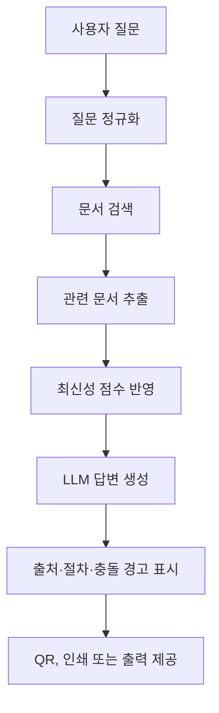

# 논문

---

| **주제** | **공식 문서 기반 학사 행정 질의응답 및 절차 안내 지능형 키오스크** |
| --- | --- |
| **핵심 문장** | 대학 공식 웹 문서를 기반으로 출처, 최신성, 문서 충돌 여부, 절차를 함께 제공하는 RAG 기반 학사 행정 안내 및 질의응답 키오스크를 설계하고 평가한다. |

### 키워드

---

| 요소 | 내용 |
| --- | --- |
| 문제 | 학교 정보가 흩어져 있다, 최신 정보 판단이 어렵다, 어디서 찾아야 할지 모르겠다 |
| 대상 | 예비학생, 학부모, 방문객, 행정 문의 학생 |
| 방법 | 크롤링 + RAG + 하이브리드 검색 + 출처 표시 |
| 차별점 | 최신성 반영, 충돌 경고, 절차 안내 |
| 검증 | 검색 성능, 답변 품질, 사용자 편의성 평가 |

### 문제와 배경

---

| 문제 | 설명 |
| --- | --- |
| 정보 산재 | 학교 정보가 여러 페이지와 문서에 흩어져 있어 찾기 어렵다 |
| 접근 경로 불명확 | 사용자가 어떤 메뉴에서 정보를 찾아야 하는지 모른다 |
| 최신성 불확실 | 오래된 공지와 최신 공지가 섞여 있어 기준 문서를 판단하기 어렵다 |
| 문서 간 불일치 | 서로 다른 페이지의 기한, 절차, 조건이 다를 수 있다 |
| 절차 이해 어려움 | 여러 문서를 읽어도 실제 행동 순서를 알기 어렵다 |

### 연구 문제

---

| 번호 | 연구 문제 | 쉬운 의미 |
| --- | --- | --- |
| RQ1 | 하이브리드 검색은 정답 문서를 더 잘 찾는가? | 검색 성능 확인 |
| RQ2 | 최신성 반영은 오래된 정보 문제를 줄이는가? | 최신 공지 우선 효과 확인 |
| RQ3 | 출처 표시는 답변 신뢰도를 높이는가? | 공식 근거 제시 효과 확인 |
| RQ4 | 절차 안내는 사용자의 이해를 돕는가? | “그래서 뭘 해야 하지?” 해결 확인 |
| RQ5 | 문서 충돌 경고는 잘못된 안내를 줄이는가? | 서로 다른 공지 충돌 처리 확인 |

| 번호 | 연구 문제 |
| --- | --- |
| RQ1 | 하이브리드 검색은 대학 공식 문서 검색 성능을 개선하는가? |
| RQ2 | 출처·최신성 표시가 사용자의 신뢰도와 이해도를 높이는가? |
| RQ3 | 절차형 안내가 행정 정보 탐색 시간을 줄이는가? |

### 차별점

---

| 차별점 | 설명 |
| --- | --- |
| 공식 문서 기반 | 학교 홈페이지의 공개 문서를 근거로 답변한다 |
| 출처 표시 | 답변에 사용된 문서 제목, 링크, 근거 문단을 보여준다 |
| 최신성 표시 | 문서 갱신 시각, 최근 공지 반영 여부를 보여준다 |
| 충돌 경고 | 날짜·절차·조건이 서로 다른 문서가 있으면 경고한다 |
| 절차 안내 | 휴학, 장학금, 증명서 등 업무를 단계별 체크리스트로 정리한다 |
| 키오스크 UI | 방문자와 학생이 현장에서 바로 사용할 수 있게 한다 |

### 시스템 구조

---

> *나는 무엇을 어떻게 만들었나?*
> 

| 구성 요소 | 설명 |
| --- | --- |
| 데이터 수집 모듈 | 학교 홈페이지 HTML/PDF 크롤링 |
| 문서 전처리 모듈 | 본문 파싱, 청킹, 메타데이터 저장 |
| 검색 모듈 | BM25 + 벡터 하이브리드 검색 |
| 답변 생성 모듈 | 검색 문서를 바탕으로 LLM 답변 생성 |
| 신뢰성 모듈 | 출처, 최신성, 충돌 여부 표시 |
| 키오스크 UI | 질문 입력, 답변, 출처 패널, QR/출력 |

### 부족한 부분

---

| 항목 | 내용 |
| --- | --- |
| 정답 데이터셋 필요 | 대표 질문 50~100여개 준비, 정답 문서 URL, 정답 문단, 기대 답변 절차 여부 라벨링 |
| 비교 기준선 필요 | BM25 only, Vector only, Hybrid, Hybrid+Freshness, etc. |
| 출처 품질 평가 필요 | ALCE는 LLM 답변의 인용 품질을 평가하는 벤치마크 |
| 충돌 탐지 규칙 평가 | 충돌 여부 라벨링, F1-score 산출 |
| 사용자 실험 필요 | 사용자가 더 빨리 찾았는가?, 사용자가 신뢰했는가?, etc. |

### 확장 가능한 부분

---

| 항목 | 내용 |
| --- | --- |
| Freshness-aware RAG | 최신 문서, 수정 날짜, 수집 날짜 점수 부여 |
| Conflict-aware RAG | 날짜, 절차 충돌 감지 경고 |
| 절차 생성 평가 | 절차 체크리스트 생성 |
| 출처 신뢰도 점수 | 공식 페이지, PDF, 오래된 문서별 신뢰도 가중치 부여 |
| RAGAS/FactScore 평가 | faithfulness, answer relevancy, context precision 측정 |
| 다국어 안내 | 영어/중국어 등 안내 |
| 장소 안내 | 건물, 부서, 운영 시간 안내 |

### 하위 페이지

---

[성능 평가](%EC%84%B1%EB%8A%A5%20%ED%8F%89%EA%B0%80%20387939f7e919804380dee9702db310a5.md)

[관련 연구](%EA%B4%80%EB%A0%A8%20%EC%97%B0%EA%B5%AC%20387939f7e919809394b1d6257c38929e.md)

[단어 사전](%EB%8B%A8%EC%96%B4%20%EC%82%AC%EC%A0%84%20387939f7e9198009ae3cd74802800de5.md)

[미팅](%EB%AF%B8%ED%8C%85%20389939f7e91980eeaefbf16f46d3b222.md)