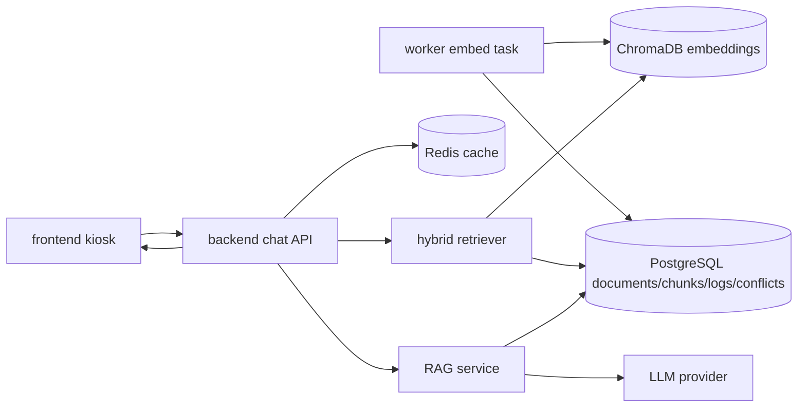
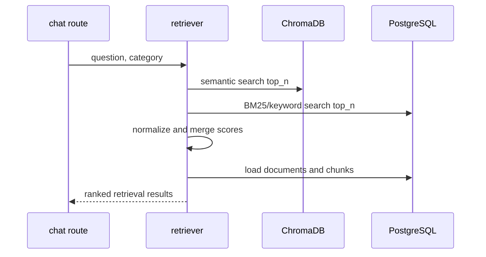
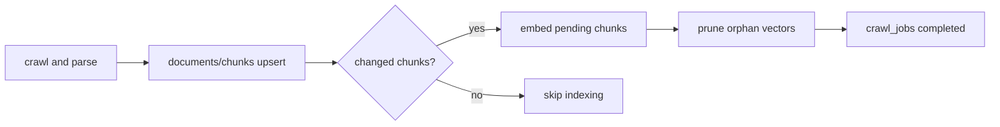

# Campus Copilot Phase 4 인덱싱·검색·RAG 설계

**날짜**: 2026-05-06
**범위**: Phase 4. 인덱싱 + 검색 + 응답 생성 + 프론트엔드 연결
**상태**: 설계 초안

## 1. 목적

Phase 4의 목적은 Phase 2에서 PostgreSQL에 적재한 공식 문서 청크를 실제 키오스크 질의응답으로 연결하는 것이다. 이 단계에서는 `document_chunks`를 임베딩하고, ChromaDB와 BM25 기반 hybrid retrieval을 구현하며, LLM provider를 통해 출처 기반 답변을 생성한다. 또한 Phase 3에서 JSON stub과 frontend fallback으로 검증하던 키오스크 답변 동선을 실제 `/api/v1/chat` SSE 응답으로 전환한다.

Phase 4는 백엔드만의 작업이 아니다. worker 인덱싱, backend 검색·RAG, API 계약, frontend streaming 표시가 하나의 사용자 동선으로 닫혀야 완료된다.

## 2. Source Documents

- `docs/superpowers/plans/2026-04-08-phase-roadmap.md`
- `docs/superpowers/specs/2026-04-08-architecture-design.md`
- `docs/superpowers/specs/2026-04-19-phase-2-crawling-parsing-design.md`
- `docs/superpowers/plans/2026-04-19-phase-2-crawling-parsing-implementation.md`
- `docs/superpowers/specs/2026-05-06-phase-3-kiosk-admin-frontend-design.md`
- `docs/superpowers/plans/2026-04-12-phase-3-kiosk-admin-frontend.md`

## 3. Scope

### Included

- `worker/tasks/embed.py` 실제 임베딩·ChromaDB 인덱싱 구현
- `document_chunks.chroma_id` 갱신과 변경 문서 재인덱싱
- ChromaDB semantic search
- BM25 keyword search
- Chroma + BM25 hybrid retrieval와 score merge
- backend `retriever`, `rag`, `llm`, `freshness`, `conflict` service 구현
- llama.cpp와 Gemini provider 추상화
- `/api/v1/chat` stub 제거와 실제 질의응답 구현
- `/api/v1/chat` SSE streaming 응답
- JSON 호환 응답 경계 정리
- 출처, 최신성, 충돌 경고, 절차 단계 응답 구조 반영
- Redis cache 적용
- `query_logs` 저장
- `/api/v1/categories` 실제 backend 공급
- `/api/v1/faq`, `/api/v1/popular` 실제 backend 공급
- Phase 3 frontend를 실제 chat, FAQ, popular API에 연결
- frontend fallback을 개발 전용 flag 뒤로 이동하고 운영 검증에서 비활성화
- `@microsoft/fetch-event-source` 기반 POST SSE client 적용
- frontend streaming 렌더링과 취소/idle reset 경계 처리
- admin logs/conflicts가 실제 DB row를 표시하도록 backend 조회 구현
- Phase 4 단위·통합·frontend 검증

### Excluded

- AWS 운영 배포, HTTPS, 도메인 연결
- Raspberry Pi kiosk 자동 시작
- Raspberry Pi print-service 실기기 출력 검증
- 운영 환경 Web Speech API STT/TTS 검증
- 관리자 인증과 권한
- 고급 관측성, 운영 알림, 장기 성능 튜닝
- 다중 대학 배포 자동화

위 제외 항목은 Phase 5 운영 배포 + Pi 통합 + 품질 보강 범위로 유지한다.

## 4. Phase Boundary Decisions

### 4.1 Phase 4는 전체 RAG 사용자 동선을 닫는다

Phase 4는 임베딩만 하거나 backend만 구현하는 단계가 아니다. 키오스크 사용자가 질문을 입력하고, 실제 공식 문서 기반 답변과 출처를 streaming으로 받는 동선까지 포함한다.

완료 기준은 다음과 같다.

- worker가 활성 청크를 ChromaDB에 인덱싱한다.
- backend가 질문에 대해 관련 청크를 검색한다.
- backend가 검색 근거만 사용해 답변을 생성한다.
- frontend가 실제 `/api/v1/chat` streaming 응답을 표시한다.
- 질의 로그와 출처 정보가 DB에 남는다.

### 4.2 Phase 3 fallback은 정상 운영 경로가 아니다

Phase 3의 categories, FAQ, popular fallback은 backend 미완성 상태에서도 UI 동선을 검증하기 위한 안전망이었다. Phase 4에서는 정상 경로를 실제 backend 응답으로 전환한다.

- `/api/v1/categories`: DB 또는 구성 기반 실제 category 목록을 반환한다.
- `/api/v1/faq`: frontend mock이 아니라 backend가 소유한 curated seed를 반환한다.
- `/api/v1/popular`: `query_logs` 기반 인기 질문을 반환한다.
- frontend fallback은 `VITE_ENABLE_KIOSK_FALLBACK=true`일 때만 개발 안전망으로 허용한다.

fallback 데이터는 실제 학사 데이터로 간주하지 않으며, 운영 정상 상태를 증명하는 근거로 쓰지 않는다. Phase 4 완료 검증에서는 fallback을 비활성화하고, `/api/v1/categories`, `/api/v1/faq`, `/api/v1/popular`의 404, 네트워크 실패, 빈 필수 데이터가 실패로 드러나야 한다.

### 4.3 SSE를 Phase 4에 포함한다

상위 아키텍처와 Phase 3 open follow-up은 `/api/v1/chat` SSE streaming 전환을 Phase 4 과제로 남겼다. 키오스크는 서서 사용하는 환경이므로 첫 응답 지연을 줄이는 것이 중요하다.

Phase 4의 기본 chat 응답은 `text/event-stream`이다. 다만 테스트와 호환성을 위해 내부 RAG service는 최종 `ChatResponse` 객체도 만들 수 있어야 한다. SSE route는 이 객체를 단계별 event로 흘려보낸다.

### 4.4 STT/TTS는 Phase 4의 핵심 RAG 완료 조건이 아니다

Phase 3는 STT/TTS를 UI 진입점으로만 제공했다. Phase 4는 streaming 답변을 표시하는 데 집중한다. Web Speech API 실제 활성화와 운영 HTTPS 검증은 Phase 5 또는 별도 UI polish 작업에서 다룬다.

## 5. Target Architecture



`worker`는 배치 인덱싱을 책임지고, `backend`는 요청 시 검색과 답변 생성을 책임진다. frontend는 검색이나 LLM 호출을 직접 수행하지 않는다.

## 6. Indexing Design

### 6.1 Input

인덱싱 대상은 PostgreSQL의 활성 청크다.

- `documents.is_active = true`
- `document_chunks.content`가 비어 있지 않음
- 신규 청크 또는 `chroma_id`가 없는 청크
- 변경된 문서의 교체 청크

Phase 2는 문서 변경 시 기존 청크를 삭제하고 새 청크를 삽입한다. Phase 4는 새 청크를 ChromaDB에 upsert하고 `document_chunks.chroma_id`를 갱신한다.

청크 교체 전에는 해당 청크를 참조하는 `conflict_pairs` 수명도 함께 처리해야 한다. 초기 방침은 교체 대상 문서의 기존 청크와 연결된 unresolved conflict를 삭제하거나 resolved 처리한 뒤 청크를 삭제하는 것이다. FK `ondelete` cascade를 추가하는 선택지는 implementation plan에서 migration 영향과 함께 검토하되, Phase 4 완료 상태에서는 재크롤이 conflict FK 때문에 실패하면 안 된다.

### 6.2 Embedding Model

기본 임베딩 모델은 상위 아키텍처 기준인 `jhgan/ko-sroberta-multitask`를 사용한다.

환경변수는 다음을 추가한다.

```bash
EMBEDDING_MODEL=jhgan/ko-sroberta-multitask
CHROMA_COLLECTION=campus_copilot_chunks
INDEX_BATCH_SIZE=64
```

worker와 backend가 같은 collection 이름을 사용해야 하므로 collection 이름은 공통 config로 둔다.

### 6.3 Chroma ID

Chroma vector id는 안정적인 청크 UUID 기반 문자열로 만든다.

```text
chunk:{document_chunks.id}
```

문서가 변경되어 청크가 교체되면 새 UUID와 새 vector id가 생긴다. Phase 4 인덱싱 작업은 삭제된 청크의 orphan vector를 정리하는 maintenance step도 포함한다.

### 6.4 Metadata

Chroma metadata에는 retrieval 후 DB 조회 없이도 기본 필터링과 디버깅이 가능하도록 최소 정보를 넣는다.

- `chunk_id`
- `document_id`
- `url`
- `title`
- `menu_path`
- `category`
- `source_type`
- `chunk_type`
- `chunk_index`
- `crawled_at`

최종 source 표시와 conflict 조회는 PostgreSQL을 기준으로 한다. Chroma metadata는 검색 보조 정보로만 취급한다.

## 7. Retrieval Design

### 7.1 Retrieval Flow



### 7.2 Chroma Search

ChromaDB는 semantic recall을 담당한다. 질문을 같은 embedding model로 임베딩하고 collection에서 top-N을 가져온다.

기본값:

- semantic top-N: 20
- final top-K: 6
- category가 있으면 category filter 적용

### 7.3 BM25 Search

BM25는 한국어 학사 용어, 메뉴명, 표 안의 짧은 키워드 검색을 보강한다. Phase 4에서는 PostgreSQL의 활성 청크를 읽어 BM25 corpus를 구성한다.

초기 구현은 backend process memory에 BM25 index를 lazy build하고, `document_chunks.created_at` watermark가 바뀌면 query 시작 시 재생성한다. 운영에서 별도 search service로 분리하는 것은 Phase 5 이후로 미룬다.

한국어 형태소 분석기는 Phase 4에서 새 인프라 부담을 만들지 않는다. 초기 tokenizer는 공백, 숫자, 한글/영문 토큰 정규화 기반으로 두고, 검색 품질 문제가 확인되면 구현 계획에서 형태소 분석기 도입을 별도 검토한다.

### 7.4 Score Merge

retriever는 Chroma distance와 BM25 score를 각각 0~1 범위로 정규화한 뒤 weighted sum으로 병합한다.

초기 가중치:

- semantic: 0.7
- BM25: 0.3

동점이면 다음 순서로 정렬한다.

1. 더 최신 `documents.crawled_at`
2. `chunk_type = table`이 질문 키워드와 더 많이 겹치는 경우
3. `documents.menu_path`
4. `document_chunks.chunk_index`

### 7.5 Retrieval Result Contract

```python
class RetrievalResult(BaseModel):
    chunk_id: UUID
    document_id: UUID
    content: str
    chunk_type: str
    score: float
    title: str | None
    url: str
    menu_path: str | None
    category: str | None
    crawled_at: datetime | None
    meta: dict | None
```

이 구조는 RAG prompt, source 표시, query log가 공통으로 사용한다.

## 8. RAG Answer Design

### 8.1 Grounding Rule

답변은 검색된 공식 문서 청크만 근거로 작성한다. 근거가 부족하면 추측하지 않고 부족하다고 답한다.

기본 답변 원칙:

- 한국어 존댓말로 답변한다.
- 학사 절차는 단계로 정리한다.
- 날짜, 기간, 금액, 자격 조건은 출처와 함께 보수적으로 표현한다.
- 서로 다른 근거가 충돌하면 단정하지 않고 conflict warning을 표시한다.
- 검색 근거에 없는 전화번호, 부서, URL을 생성하지 않는다.

### 8.2 Prompt Inputs

RAG service는 LLM provider에 다음 정보를 전달한다.

- 사용자 질문
- 선택 category
- top retrieval chunks
- source metadata
- conflict pairs
- freshness summary

표 청크는 분할하지 않고 그대로 컨텍스트에 넣는다. LLM context가 길어지는 경우 표 청크를 우선 보존하고 낮은 score 텍스트 청크를 줄인다.

### 8.3 Procedure Steps

절차 단계는 LLM이 답변 본문과 별도로 추출하거나 생성한다. 단, 근거 청크에 절차적 표현이 없으면 빈 배열을 반환한다.

절차 단계는 다음 조건을 만족해야 한다.

- 각 단계는 한 문장 이하
- 원문 근거에 없는 승인자, 제출처, 시스템명을 만들지 않음
- 순서가 불확실하면 "문서에서 확인되는 절차" 수준으로만 표시

### 8.4 Freshness

Phase 3의 `freshness`는 top-level `recent | stale`이었다. Phase 4에서는 source별 freshness를 계산하되, frontend 호환을 위해 top-level freshness도 유지한다.

source freshness:

- `recent`: `crawled_at`이 있고 stale 기준보다 최신
- `stale`: `crawled_at`이 없거나 stale 기준보다 오래됨

초기 stale 기준:

```bash
FRESHNESS_STALE_DAYS=180
```

top-level freshness는 사용된 source 중 하나라도 stale이면 `stale`, 모두 recent이면 `recent`로 계산한다.

### 8.5 Conflict Warning

Phase 4는 `conflict_pairs` 조회를 실제 응답에 반영한다. 검색된 chunk와 연결된 unresolved conflict가 있으면 `conflict_warning.exists = true`로 반환한다.

warning description은 다음 우선순위로 만든다.

1. `conflict_pairs.description`
2. conflict type과 관련 source title 요약
3. "관련 문서 간 내용 차이가 있어 담당 부서 확인이 필요합니다."

conflict scan 자체를 고도화하는 작업은 Phase 4의 핵심 완료 조건이 아니다. 다만 기존 또는 기본 rule로 저장된 conflict row를 조회하고 표시하는 기능은 Phase 4에 포함한다.

## 9. LLM Provider Design

### 9.1 Provider Protocol

```python
class LLMProvider(Protocol):
    async def generate(self, messages: list[LLMMessage]) -> str: ...
    async def stream(self, messages: list[LLMMessage]) -> AsyncIterator[str]: ...
```

RAG service는 provider 구현체가 아니라 protocol에만 의존한다.

### 9.2 Providers

Phase 4 기본 provider:

- `LlamaCppProvider`: 로컬 개발과 데모
- `GeminiProvider`: 운영 후보

환경변수:

```bash
LLM_PROVIDER=llama_cpp
LLAMA_CPP_BASE_URL=http://localhost:8080
LLAMA_CPP_MODEL=local
GEMINI_API_KEY=
GEMINI_MODEL=
```

`GEMINI_MODEL` 값은 구현 시점에 공식 Google Gen AI SDK 문서와 사용 가능 모델을 확인해 확정한다. 모델명을 설계서에서 고정하지 않는 이유는 provider별 모델 가용성이 바뀔 수 있기 때문이다.

provider별 필수 설정 검증은 backend 시작 또는 provider 생성 시점에 수행한다.

- `LLM_PROVIDER=llama_cpp`: `LLAMA_CPP_BASE_URL`, `LLAMA_CPP_MODEL` 필요
- `LLM_PROVIDER=gemini`: `GEMINI_API_KEY`, `GEMINI_MODEL` 필요
- 운영 설정은 stable model string을 사용하고, `latest`, preview, experimental 모델은 명시적으로 선택한 경우에만 허용한다.

로컬 provider는 `llama.cpp` server의 OpenAI-compatible chat/completions API를 기준으로 한다. GGUF 모델 파일 선택과 `llama-server` 실행 옵션은 배포 장비 성능에 따라 달라지므로 Phase 4 구현 계획에서 고정하지 않는다. OpenAI, Claude 등 추가 provider는 Phase 4 구조가 허용하되 구현 범위에는 포함하지 않는다.

### 9.3 Failure Behavior

LLM 호출이 실패하면 빈 응답을 반환하지 않는다.

- 검색 결과가 있으면 "답변 생성에 실패했지만 관련 출처를 확인해 주세요." 메시지와 source를 반환한다.
- 검색 결과가 없으면 "관련 문서를 찾지 못했습니다." 메시지를 반환한다.
- 실패도 `query_logs`에 기록한다.
- frontend는 오류 event를 받으면 기존 Phase 3 오류 문구를 표시하되, source가 있으면 함께 보여준다.

## 10. Chat API Design

### 10.1 Request

```json
{
  "question": "휴학 신청은 어떻게 하나요?",
  "category": "academic"
}
```

`question`은 필수이며 빈 문자열은 422 또는 400으로 거절한다. `category`는 선택값이다.

### 10.2 SSE Events

`POST /api/v1/chat`의 기본 응답은 `text/event-stream`이다.

이벤트 형식:

```text
event: metadata
data: {"sources":[...],"freshness":"recent","conflict_warning":{"exists":false}}

event: token
data: {"text":"휴학"}

event: token
data: {"text":" 신청은"}

event: procedure_steps
data: {"procedure_steps":["포털에 로그인합니다.","휴학 신청 메뉴에서 신청서를 작성합니다."]}

event: done
data: {"answer":"휴학 신청은 ...","sources":[...],"procedure_steps":[...],"conflict_warning":{"exists":false},"freshness":"recent"}
```

오류 이벤트:

```text
event: error
data: {"message":"답변 생성에 실패했습니다.","retryable":true}
```

`metadata` event는 retrieval 직후 확정 가능한 값만 담는다. `procedure_steps`는 LLM 출력 또는 후처리 이후에만 알 수 있으므로 별도 `procedure_steps` event나 `done` payload에서 확정한다. 이 계약은 상위 아키텍처의 `type` 필드 기반 SSE 예시를 Phase 4에서 named event 방식으로 구체화한 것이다.

### 10.3 Done Payload

최종 payload는 기존 `ChatResponse`와 호환되는 snake_case 구조를 유지한다.

```json
{
  "answer": "휴학 신청은 ...",
  "sources": [
    {
      "title": "학사안내 > 휴학·복학",
      "url": "https://www.honam.ac.kr/...",
      "crawled_at": "2026-05-06T03:00:00+09:00",
      "freshness": "recent",
      "chunk_id": "..."
    }
  ],
  "procedure_steps": ["포털에 로그인합니다.", "휴학 신청 메뉴에서 신청서를 작성합니다."],
  "conflict_warning": {
    "exists": false,
    "description": null
  },
  "freshness": "recent"
}
```

Phase 3 frontend는 source별 freshness가 없을 수 있음을 전제로 했다. Phase 4 frontend는 source별 freshness를 우선 사용하고, 없으면 top-level freshness를 주입하는 기존 fallback mapping을 유지한다.

### 10.4 Cache

Redis cache key는 정규화된 질문과 category를 기준으로 한다.

```text
chat:v1:{category}:{normalized_question_hash}
```

cache hit 시에도 SSE event 순서는 유지한다. metadata와 done을 즉시 보내고, token replay는 하지 않는다. TTL 기본값은 1시간이다.

```bash
CHAT_CACHE_TTL_SECONDS=3600
```

cache hit 응답도 `query_logs`에 남긴다. Phase 4에서는 추가 migration 없이 `sources` JSONB에 아래 query metadata를 함께 저장한다.

```json
{
  "_meta": {
    "status": "success",
    "cache_hit": true,
    "category": "academic",
    "normalized_query": "휴학 신청은 어떻게 하나요",
    "error_type": null
  },
  "items": []
}
```

`sources` JSONB가 배열일 수도 있다는 기존 아키텍처 예시와 충돌하지 않도록, Phase 4 구현은 admin/log 조회에서 list와 object wrapper를 모두 읽을 수 있게 한다. 새 컬럼 추가가 필요해지면 implementation plan에서 Alembic migration으로 분리한다.

## 11. Backend Service Design

### 11.1 Module Layout

```text
backend/app/services/
  retriever.py
  rag.py
  llm.py
  freshness.py
  conflict.py
  query_log.py
```

`chat.py` route는 orchestration만 담당하고, 검색·prompt·provider·로그 로직을 직접 품지 않는다.

### 11.2 Service Responsibilities

| Service | Responsibility |
|---------|----------------|
| `retriever.py` | Chroma + BM25 검색, score merge, top-K 결과 반환 |
| `rag.py` | prompt 구성, LLM 호출, answer/procedure/source 조립 |
| `llm.py` | llama.cpp/Gemini provider 추상화 |
| `freshness.py` | source별/top-level freshness 계산 |
| `conflict.py` | 검색된 chunk 관련 unresolved conflict 조회 |
| `query_log.py` | 성공/실패/cached query log 저장 |

### 11.3 Database Access

backend는 SQLAlchemy async session을 사용한다. ChromaDB client와 BM25 index는 app lifecycle에서 초기화하거나 lazy singleton으로 관리한다.

BM25 index는 backend process memory에 두되, DB 청크 변경을 놓치지 않도록 watermark 기반 lazy rebuild를 사용한다. backend는 마지막으로 본 `max(document_chunks.created_at)` 값을 보관하고, query 시작 시 현재 watermark가 달라졌으면 BM25 index를 재생성한다.

- backend 시작 시
- query 시작 시 `document_chunks.created_at` watermark 변경 감지
- admin crawl 요청이 같은 backend process 안에서 완료된 경우 즉시 refresh
- 수동 refresh internal function 호출

## 12. Worker Integration

### 12.1 Embed Task

`worker/tasks/embed.py`는 stub에서 실제 task로 전환한다.

주요 함수:

```python
async def embed_pending_chunks() -> EmbedSummary: ...
async def reindex_document(document_id: UUID) -> EmbedSummary: ...
async def prune_orphan_vectors() -> int: ...
```

`EmbedSummary`는 최소한 다음 값을 가진다.

- `chunks_seen`
- `chunks_indexed`
- `chunks_skipped`
- `vectors_pruned`
- `errors`

### 12.2 Scheduler Flow

크롤링이 끝난 뒤 변경된 문서가 있으면 인덱싱을 실행한다.



인덱싱 실패는 crawl 자체의 수집 성공을 무조건 실패로 바꾸지 않는다. 다만 `crawl_jobs.error`에 요약을 남기고 admin status에서 확인 가능해야 한다.

## 13. Categories, FAQ, and Popular APIs

### 13.1 Categories

Phase 4에서는 `/api/v1/categories`를 실제 backend 응답으로 확정한다. 초기 category 목록은 `documents.category`의 활성 값과 backend curated label map을 조합해 만든다.

응답은 Phase 3 frontend 타입을 유지한다.

```json
[
  {
    "id": "academic",
    "name": "학사행정"
  }
]
```

활성 문서에 category가 없더라도 kiosk 진입을 위해 backend는 최소 curated category 목록을 반환한다. 이 목록은 frontend fallback이 아니라 backend 소유 구성이다.

### 13.2 FAQ

Phase 4에서는 `/api/v1/faq`를 backend에 추가한다.

초기 FAQ 공급 방식은 backend curated seed + category filter로 둔다. 이 seed는 frontend mock이 아니라 backend 소유 데이터이며, 각 항목은 검수된 질문, category, 우선순위, 연결 가능한 source URL 또는 document id를 가진다. 검색/로그 기반 자동 FAQ 생성은 품질 검증 전까지 운영 정상 경로로 삼지 않는다.

응답:

```json
[
  {
    "id": "academic-leave",
    "question": "휴학 신청은 어떻게 하나요?",
    "category_id": "academic",
    "priority": 10,
    "source_url": "https://www.honam.ac.kr/..."
  }
]
```

### 13.3 Popular

`/api/v1/popular`는 `query_logs` 기준으로 최근 질문 빈도를 집계한다.

초기 기준:

- 최근 30일
- 동일 질문은 정규화 후 grouping
- 상위 10개
- 로그가 없으면 빈 배열 반환

frontend는 빈 배열을 정상 empty state로 표시한다. 운영 정상 경로에서 frontend mock popular를 대신 보여주지 않는다.

## 14. Frontend Integration

### 14.1 Chat Hook

`useChat`은 JSON `postChat` 중심에서 `@microsoft/fetch-event-source` 기반 SSE client로 전환한다. 브라우저 내장 `EventSource`는 POST body를 보낼 수 없으므로 사용하지 않는다.

동작:

1. 질문 제출 시 `answerData.isStreaming = true`로 설정한다.
2. `fetchEventSource`로 `POST /api/v1/chat`을 호출하고 `Accept: text/event-stream`을 보낸다.
3. `metadata` event를 받으면 source/conflict/freshness 초기값을 표시한다.
4. `token` event를 받을 때마다 answer text를 append한다.
5. `procedure_steps` event를 받으면 절차 영역을 갱신한다.
6. `done` event를 받으면 최종 `AnswerData`로 치환하고 `isStreaming = false`로 둔다.
7. `error` event 또는 network failure면 오류 문구를 표시하고 `isStreaming = false`로 둔다.

### 14.2 Request Cancellation

다음 경우 진행 중인 SSE 요청을 abort한다.

- 사용자가 처음으로 이동
- idle reset 발생
- 새 질문 제출
- 컴포넌트 unmount

이전 요청에서 늦게 도착한 event가 현재 답변을 덮어쓰지 않도록 Phase 3의 request id guard를 유지한다.

### 14.3 API Fallback Policy

Phase 4 이후 fallback 정책은 다음과 같다.

- chat: fallback 답변을 생성하지 않는다. 실패 문구와 가능한 source만 표시한다.
- categories/FAQ/popular: `VITE_ENABLE_KIOSK_FALLBACK=true`일 때만 개발 안전망 fallback을 허용한다.
- `VITE_ENABLE_KIOSK_FALLBACK=false` 또는 미설정 운영 검증에서는 backend 실패를 화면 오류와 테스트 실패로 드러낸다.
- 정상 운영 검증은 fallback 비활성 상태에서 수행한다.

## 15. Admin Integration

Phase 4는 admin stub route를 실제 DB 조회로 바꾼다.

- `/api/v1/admin/status`: 활성 문서 수, 청크 수, 마지막 crawl, 인덱싱 상태 요약
- `/api/v1/admin/conflicts`: unresolved conflict 목록
- `/api/v1/admin/logs`: 최근 query log 목록
- `/api/v1/admin/crawl`: 기존 수동 crawl trigger를 유지하고, 완료 후 인덱싱 refresh로 이어지게 한다.

admin 인증은 Phase 4 범위가 아니다.

## 16. Error Handling

### 16.1 No Retrieval Results

검색 결과가 없으면 LLM을 호출하지 않는다.

응답:

- answer: "관련 공식 문서를 찾지 못했습니다. 질문을 조금 더 구체적으로 입력해 주세요."
- sources: []
- procedure_steps: []
- conflict_warning.exists: false
- freshness: "stale"
- log metadata reason: `no_sources`

source가 없을 때 top-level freshness를 `stale`로 두는 것은 Phase 3 frontend 호환 때문이다. UI는 `sources.length === 0`이면 오래된 출처가 아니라 "관련 공식 문서 없음" 상태로 표시한다.

### 16.2 Partial Source Metadata Missing

청크는 찾았지만 문서 메타데이터가 일부 없으면 source를 버리지 않는다.

- title이 없으면 menu_path 또는 URL을 사용한다.
- crawled_at이 없으면 source freshness를 stale로 둔다.
- URL이 없으면 source 표시에서 제외하고 query log에는 chunk_id를 남긴다.

### 16.3 Streaming Failure

stream 중간 실패 시 frontend는 지금까지 받은 텍스트를 유지하되, 완료되지 않은 답변임을 표시한다. backend는 실패 상태를 query log에 남긴다.

## 17. Security and Privacy

- query log에는 사용자의 질문과 생성 답변이 저장된다.
- kiosk는 공개 장소 장비이므로 개인식별정보 입력을 유도하지 않는다.
- prompt에는 필요한 청크와 메타데이터만 넣고 DB 연결 문자열, API key, 내부 오류 trace를 넣지 않는다.
- LLM provider 오류 메시지는 사용자에게 원문 그대로 노출하지 않는다.

## 18. Configuration

Phase 4에서 필요한 설정값:

```bash
EMBEDDING_MODEL=jhgan/ko-sroberta-multitask
CHROMA_COLLECTION=campus_copilot_chunks
INDEX_BATCH_SIZE=64
RETRIEVER_SEMANTIC_TOP_N=20
RETRIEVER_BM25_TOP_N=20
RETRIEVER_FINAL_TOP_K=6
RETRIEVER_SEMANTIC_WEIGHT=0.7
RETRIEVER_BM25_WEIGHT=0.3
FRESHNESS_STALE_DAYS=180
CHAT_CACHE_TTL_SECONDS=3600
LLM_PROVIDER=llama_cpp
LLAMA_CPP_BASE_URL=http://localhost:8080
LLAMA_CPP_MODEL=local
GEMINI_MODEL=
VITE_ENABLE_KIOSK_FALLBACK=false
```

기존 설정값인 `CHROMA_HOST`, `CHROMA_PORT`, `REDIS_URL`, `LLM_PROVIDER`, `GEMINI_API_KEY`를 계속 사용한다. 로컬 LLM 설정은 `OLLAMA_*`가 아니라 `LLAMA_CPP_*`를 사용한다.

## 19. Testing and Verification

### 19.1 Worker Tests

- pending chunk만 인덱싱하는지 확인
- Chroma id가 `chunk:{uuid}` 형식인지 확인
- 인덱싱 후 `document_chunks.chroma_id`가 갱신되는지 확인
- orphan vector prune 동작 확인
- embedding provider 실패 시 summary error가 남는지 확인

### 19.2 Backend Tests

- Chroma search 결과와 BM25 결과 merge
- category filter 적용
- no result 응답
- freshness 계산
- conflict warning 조회
- LLM provider protocol mock 기반 RAG answer 조립
- query log 성공/실패 저장
- Redis cache hit 응답
- `/api/v1/chat` SSE event 순서

### 19.3 Frontend Tests

- metadata event 수신 시 source/conflict 표시
- token event append
- procedure_steps event 처리
- done event에서 `isStreaming = false`
- error event 표시
- 새 질문 제출 시 이전 stream 무시
- idle reset 시 stream abort
- fallback flag가 false일 때 categories/FAQ/popular backend 실패를 fallback으로 숨기지 않음
- categories/FAQ/popular backend 성공 시 mock fallback을 사용하지 않음

### 19.4 Smoke Verification

Phase 4 완료 전 최소 smoke:

1. `docker compose up --build`
2. worker crawl 또는 fixture seed로 documents/chunks 적재
3. embed task 실행 후 Chroma collection에 vector 생성 확인
4. `/api/v1/chat`에 실제 질문 POST
5. SSE `metadata`, `token`, `procedure_steps`, `done` event 확인
6. kiosk 화면에서 질문 → streaming 답변 → source 표시 확인
7. `/admin`에서 query log 확인
8. `VITE_ENABLE_KIOSK_FALLBACK=false` 상태에서 categories/FAQ/popular가 backend 응답으로 표시되는지 확인

## 20. Implementation Order

Phase 4는 전체 범위를 한 번에 명시하되 구현은 다음 순서로 나눈다.

1. 공통 config와 dependency 정리
2. worker embedding/indexing 구현
3. backend Chroma client와 BM25 retriever 구현
4. freshness/conflict/query_log service 구현
5. LLM provider protocol과 llama.cpp/Gemini provider 구현
6. RAG service와 prompt 구성 구현
7. `/api/v1/chat` SSE route 구현
8. categories/FAQ/popular/admin 실제 backend 조회 구현
9. frontend `useChat` SSE 전환
10. frontend fallback 정책 정리와 테스트 갱신
11. docker compose smoke와 문서 검증

## 21. Completion Criteria

Phase 4는 다음 조건을 만족해야 완료로 본다.

- Phase 2 청크가 ChromaDB에 인덱싱된다.
- `document_chunks.chroma_id`가 실제 vector id와 연결된다.
- hybrid retrieval이 source metadata와 함께 top-K 결과를 반환한다.
- `/api/v1/chat`이 stub이 아닌 실제 검색·LLM 기반 SSE 응답을 반환한다.
- 답변은 출처, 절차, freshness, conflict warning을 포함한다.
- query log가 저장되고 admin 화면에서 확인된다.
- frontend kiosk에서 실제 질문에 대한 streaming 답변을 표시한다.
- categories/FAQ/popular 정상 경로가 backend 응답으로 전환된다.
- fallback 비활성 상태에서도 kiosk main → input → answer 동선이 동작한다.
- Phase 4 테스트와 docker compose smoke가 통과한다.
